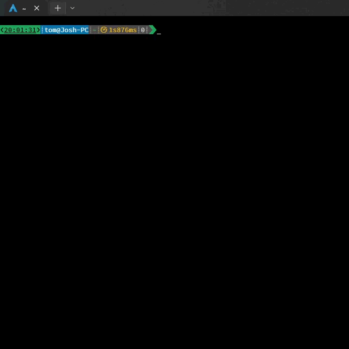

<h6>
  <! --   COLOR SCHEME
  Last Commit: #1DA65A
  Repo Size:   #0A75AD
  Discord:     #5865F2
  License:     #663366
  Total Lines: #E26D0E
  Commits:     #F5FBFF
  Badge bg:    #4F4D4B
  --> </h6>

  <h1>TomIO's dotfile repository <!-- omit in toc --></h1>
    <h3 align="center">
      --Repo stats-- 
      
      
   
      
      
      
    </h3>

Table of contents: <i><b>*(WIP)*</i></b>

- 🚧Undergoing🚧
  - 🚧complete rewrite🚧

---

## Starship Prompt theme

### [starship.toml](dot_config/private_starship.toml)

Main configuration file for [Starship Prompt](https://starship.rs/)

>File renamed due to `chezmoi`. 
>Rename to `starship.toml`, and place in `~/.config` to use.

Demo GIF

    

<h1><em></em></h1> <!-- thin separator -->

<!-- starship.toml ToC -->

 <!-- L1 -->

Overview:

  <ul> 
    <li><a href="#demo-gif">Demo GIF</a></li>
    <li><a href="#summary">Full Prompt</a></li>
      
<!-- L2 -->
      
Modules

        <ul style="line-height:1.2"><samp>
          <li><a href="#time">time</a></li>
          <li><a href="#shlvl">shlvl</a></li>
          <li><a href="#jobs">jobs</a></li>
          <li><a href="#sudo">sudo</a></li>
          <li><a href="#username">username</a></li>
          <li><a href="#hostname">hostname</a></li>
          <li><a href="#shell">shell</a></li>
          <li>

<a href="#env_var">env_var</a>
<!-- DL2.1 -->
            <ul>
              <li><a href="#env_var-termux">termux</a></li>
            </ul>
<!-- End of DL2.1 -->
          <li>

<a href="#directory">directory</a>
<!-- DL2.2 -->
            <ul>
              <li><a href="#dir_sub">directory substitutions</a></li>
            </ul>
<!-- End of DL2.2 -->
          <li><a href="#git_metrics">git_metrics</a></li>
          <li><a href="#git_branch">git_branch</a></li>
          <li><a href="#git_commit">git_commit</a></li>
          <li><a href="#git_status">git_status</a></li>
          <li><a href="#git_state">git_state</a></li>
          <li><a href="#cmd_duration">cmd_duration</a></li>
          <li>

<a href="#status">status</a>
<!-- DL2.2 --> 
            <ul>
              <li><a href="#status-success">success</a></li>
              <li><a href="#status-fail">failure</a></li>
              <li><a href="#status-not-found">not found</a></li>
              <li><a href="#status-interrupt">sig_int</a></li>
              <li><a href="#status-signal">signal</a></li>
              <li><a href="#status-not-executable">not executable</a></li>
            </ul>
<!-- End of DL2.3 -->
        </ul></samp>
      
<!-- End of L2 -->
  </ul>

<!-- End of L1 -->

 
<h1><em></em></h1> <!-- thin separator -->

<h2>
Full Prompt: 
<picture>
   <a href=#time><!--
--></a><!--
--><a href=#sudo><!--
--></a><!--
--><a href=#jobs><!--
--></a><!--
--><a href=#shlvl><!--
--></a><!--
--><a href=#username><!--
--></a><!--
--><a href=#hostname><!--
--><!--
--><a href=#env_var-termux><!--
--></a><!--
--><a href=#directory><!--
--></a><!--
--><a href=#dir_sub><!--
--></a><!--
--><a href=#directory><!--
--></a><!--
--><a href=#git_metrics><!--
--></a><!--
--><a href=#git_branch><!--
--></a><!--
--><a href=#git_commit><!--
--></a><!--
--><a href=#git_status><!--
--></a><!--
--><a href=#git_state><!--
--></a><!--
--><a href=#cmd_duration><!--
--></a><!--
--><a href=#status><!--
--></a>
</picture>
<!--
❮HH:MM:SS❯ 32user@hostname /usr/ex/am.ple72⥮19 main#4ec0fa8merging❮3/5❯1s993ms148
-->
  

  
<a href=https://github.com/github/markup/issues/1440>Why is this a set static images?</a>

  <blockquote>
  <samp style="font-size: 14pt">
<!-- SVGs generated with https://danmarshall.github.io/google-font-to-svg-path/ -->
<!-- #time --><a href="#time" style="background-color:#1DA65A;color:#0A0400"><!--
-->❮<u>HH:MM:SS</u>❯</a><!--
-- #sudo --><a href="#sudo" style="background-color:#0A75AD;color:#D61E1C"><!--
--  <uF43D> --><svg width="13" height="12.25" viewBox="0 0 13 12.25" transform="translate(0,0)" xmlns="http://www.w3.org/2000/svg"><g id="svgGroup" stroke-linecap="round" fill-rule="evenodd" font-size="14pt" stroke="currentColor" stroke-width="0.25mm" fill="currentColor" style="stroke:currentColor;stroke-width:0.25mm;fill:currentColor"><path d="M 5.808 4.556 L 0 10.364 L 0 11.315 L 0.935 12.25 L 2.836 12.25 L 3.771 11.315 L 3.771 10.364 L 4.707 10.364 L 4.707 9.414 L 5.657 9.414 L 5.657 8.479 L 7.543 8.479 L 8.644 7.377 C 8.855 7.488 9.117 7.543 9.429 7.543 A 3.632 3.632 0 0 0 12.064 6.476 A 4.346 4.346 0 0 0 12.099 6.442 A 3.631 3.631 0 0 0 13.2 3.821 A 4.44 4.44 0 0 0 13.2 3.772 A 3.657 3.657 0 0 0 12.133 1.129 A 4.388 4.388 0 0 0 12.099 1.094 C 11.365 0.365 10.475 0.001 9.429 0.001 A 3.632 3.632 0 0 0 6.793 1.068 A 4.346 4.346 0 0 0 6.758 1.102 A 3.631 3.631 0 0 0 5.657 3.723 A 4.44 4.44 0 0 0 5.657 3.772 A 2.542 2.542 0 0 0 5.675 4.082 C 5.698 4.266 5.742 4.424 5.808 4.556 Z M 9.873 4.012 A 1.824 1.824 0 0 0 10.371 4.074 C 11.024 4.074 11.423 3.821 11.569 3.317 A 1.792 1.792 0 0 0 11.631 2.822 C 11.631 2.173 11.377 1.776 10.87 1.632 A 1.824 1.824 0 0 0 10.371 1.569 C 9.719 1.569 9.32 1.822 9.174 2.326 A 1.792 1.792 0 0 0 9.112 2.822 C 9.112 3.47 9.365 3.867 9.873 4.012 Z" vector-effect="non-scaling-stroke"/></g></svg><!--
--></a><!--
-- #jobs --><a href="#jobs" style="background-color:#0A75AD;color:#EDBC00"><!--
--  <uE621> --><svg style="padding-left:2px;padding-right:2px" width="1.5" height="22" viewBox="0 0 1.5 22" transform="translate(0,6)" xmlns="http://www.w3.org/2000/svg"><g id="svgGroup" stroke-linecap="round" fill-rule="evenodd" font-size="14pt" stroke="currentColor" stroke-width="0.25mm" fill="currentColor" style="stroke:currentColor;stroke-width:0.25mm;fill:currentColor"><path d="M 0.756 7.356 A 0.44 0.44 0 0 0 0.757 7.356 C 0.94 7.356 1.123 7.287 1.284 7.127 C 1.398 6.967 1.49 6.806 1.49 6.6 A 0.715 0.715 0 0 0 1.407 6.272 A 1.526 1.526 0 0 0 1.284 6.073 A 0.827 0.827 0 0 0 1.097 5.931 C 0.988 5.871 0.873 5.844 0.757 5.844 A 0.44 0.44 0 0 0 0.756 5.844 A 0.914 0.914 0 0 0 0.369 5.966 A 0.498 0.498 0 0 0 0.229 6.096 A 0.563 0.563 0 0 0 0.004 6.522 A 0.869 0.869 0 0 0 0 6.6 A 0.701 0.701 0 0 0 0.093 6.951 A 0.832 0.832 0 0 0 0.229 7.127 A 0.509 0.509 0 0 0 0.564 7.34 C 0.622 7.351 0.686 7.356 0.756 7.356 Z M 1.141 13.105 A 0.706 0.706 0 0 0 1.284 12.994 A 0.658 0.658 0 0 0 1.403 12.828 C 1.456 12.726 1.49 12.598 1.49 12.444 A 0.733 0.733 0 0 0 1.364 12.06 A 2.018 2.018 0 0 0 1.284 11.94 A 0.827 0.827 0 0 0 1.097 11.798 C 0.988 11.738 0.873 11.711 0.757 11.711 A 0.44 0.44 0 0 0 0.756 11.711 A 0.733 0.733 0 0 0 0.361 11.816 A 0.481 0.481 0 0 0 0.229 11.94 A 0.935 0.935 0 0 0 0.108 12.087 A 0.63 0.63 0 0 0 0 12.444 A 1.015 1.015 0 0 0 0.014 12.621 C 0.028 12.696 0.051 12.761 0.084 12.817 A 0.511 0.511 0 0 0 0.229 12.971 A 0.509 0.509 0 0 0 0.564 13.183 C 0.622 13.195 0.686 13.2 0.756 13.2 C 0.888 13.2 1.019 13.177 1.141 13.105 Z M 1.141 18.971 A 0.706 0.706 0 0 0 1.284 18.861 A 1.124 1.124 0 0 0 1.474 18.471 A 0.616 0.616 0 0 0 1.49 18.334 A 0.814 0.814 0 0 0 1.391 17.953 A 0.643 0.643 0 0 0 1.284 17.806 A 0.827 0.827 0 0 0 1.097 17.665 C 0.988 17.605 0.873 17.577 0.757 17.577 A 0.44 0.44 0 0 0 0.756 17.577 A 0.914 0.914 0 0 0 0.369 17.699 A 0.498 0.498 0 0 0 0.229 17.829 A 0.564 0.564 0 0 0 0.004 18.255 A 0.869 0.869 0 0 0 0 18.334 A 0.633 0.633 0 0 0 0.118 18.706 A 0.956 0.956 0 0 0 0.229 18.838 A 0.509 0.509 0 0 0 0.564 19.05 C 0.622 19.061 0.686 19.067 0.756 19.067 C 0.888 19.067 1.019 19.043 1.141 18.971 Z M 0.734 10.267 C 0.94 10.267 1.123 10.221 1.284 10.061 A 3.299 3.299 0 0 0 1.373 9.91 C 1.394 9.872 1.413 9.835 1.43 9.797 A 0.655 0.655 0 0 0 1.49 9.534 C 1.49 9.327 1.398 9.144 1.284 9.029 A 0.827 0.827 0 0 0 1.097 8.888 C 0.988 8.828 0.873 8.8 0.757 8.8 A 0.44 0.44 0 0 0 0.756 8.8 C 0.55 8.8 0.344 8.846 0.229 9.006 A 0.509 0.509 0 0 0 0.017 9.342 C 0.006 9.399 0 9.463 0 9.534 A 0.649 0.649 0 0 0 0.055 9.797 C 0.087 9.872 0.134 9.946 0.199 10.024 A 1.539 1.539 0 0 0 0.229 10.061 A 0.498 0.498 0 0 0 0.588 10.258 A 1.078 1.078 0 0 0 0.734 10.267 Z M 0.756 1.467 A 0.44 0.44 0 0 0 0.757 1.467 C 0.94 1.467 1.123 1.398 1.284 1.284 A 0.963 0.963 0 0 0 1.49 0.744 A 0.697 0.697 0 0 0 1.49 0.734 C 1.49 0.527 1.398 0.344 1.284 0.229 A 0.827 0.827 0 0 0 1.097 0.088 C 0.988 0.028 0.873 0 0.757 0 A 0.44 0.44 0 0 0 0.756 0 A 0.733 0.733 0 0 0 0.361 0.105 A 0.481 0.481 0 0 0 0.229 0.229 A 0.564 0.564 0 0 0 0.004 0.655 A 0.869 0.869 0 0 0 0 0.734 A 0.701 0.701 0 0 0 0.093 1.084 A 0.832 0.832 0 0 0 0.229 1.261 A 0.453 0.453 0 0 0 0.532 1.449 C 0.583 1.459 0.64 1.464 0.702 1.466 A 1.821 1.821 0 0 0 0.756 1.467 Z M 0.756 16.134 A 0.676 0.676 0 0 0 0.757 16.133 C 0.94 16.11 1.123 16.019 1.284 15.904 A 1.35 1.35 0 0 0 1.441 15.633 A 0.615 0.615 0 0 0 1.49 15.4 A 0.715 0.715 0 0 0 1.407 15.072 A 1.526 1.526 0 0 0 1.284 14.873 A 0.827 0.827 0 0 0 1.097 14.731 C 0.988 14.671 0.873 14.644 0.757 14.644 A 0.44 0.44 0 0 0 0.756 14.644 A 0.733 0.733 0 0 0 0.361 14.749 A 0.481 0.481 0 0 0 0.229 14.873 A 0.564 0.564 0 0 0 0.004 15.299 A 0.869 0.869 0 0 0 0 15.377 A 0.739 0.739 0 0 0 0.187 15.882 A 0.907 0.907 0 0 0 0.229 15.927 C 0.344 16.042 0.504 16.134 0.756 16.134 Z M 0.734 4.4 A 0.739 0.739 0 0 0 1.238 4.214 A 0.907 0.907 0 0 0 1.284 4.171 A 0.7 0.7 0 0 0 1.415 3.986 C 1.461 3.892 1.49 3.783 1.49 3.667 A 0.776 0.776 0 0 0 1.391 3.312 A 1.475 1.475 0 0 0 1.284 3.14 A 0.698 0.698 0 0 0 1.119 3.017 C 1.003 2.954 0.88 2.934 0.756 2.934 A 0.866 0.866 0 0 0 0.416 2.993 A 0.438 0.438 0 0 0 0.229 3.14 A 0.935 0.935 0 0 0 0.108 3.287 A 0.63 0.63 0 0 0 0 3.644 A 0.739 0.739 0 0 0 0.187 4.148 A 0.907 0.907 0 0 0 0.229 4.194 A 0.498 0.498 0 0 0 0.588 4.391 A 1.078 1.078 0 0 0 0.734 4.4 Z M 0.756 22 A 0.33 0.33 0 0 0 0.757 22 C 0.94 22 1.123 21.908 1.284 21.748 A 0.7 0.7 0 0 0 1.415 21.563 C 1.461 21.469 1.49 21.36 1.49 21.244 A 0.775 0.775 0 0 0 1.391 20.89 A 1.476 1.476 0 0 0 1.284 20.717 A 0.976 0.976 0 0 0 0.89 20.545 C 0.846 20.538 0.802 20.534 0.757 20.534 A 0.44 0.44 0 0 0 0.756 20.534 A 0.911 0.911 0 0 0 0.412 20.6 C 0.345 20.628 0.285 20.664 0.239 20.708 A 0.414 0.414 0 0 0 0.229 20.717 C 0.069 20.877 0 21.038 0 21.244 A 0.733 0.733 0 0 0 0.105 21.64 A 0.481 0.481 0 0 0 0.229 21.771 A 0.509 0.509 0 0 0 0.564 21.983 C 0.622 21.995 0.686 22 0.756 22 Z" vector-effect="non-scaling-stroke"/></g></svg>3<!--
--  <uF2D2> --><svg width="13" height="11.5" viewBox="0 0 13 11.5" transform="translate(0,0)" xmlns="http://www.w3.org/2000/svg"><g id="svgGroup" stroke-linecap="round" fill-rule="evenodd" font-size="14pt" stroke="currentColor" stroke-width="0.25mm" fill="currentColor" style="stroke:currentColor;stroke-width:0.25mm;fill:currentColor"><path d="M 12.172 0 L 5.982 0 A 1.03 1.03 0 0 0 4.954 1.028 L 4.954 3.303 L 1.028 3.303 A 1.03 1.03 0 0 0 0 4.331 L 0 10.521 C 0 11.087 0.462 11.549 1.028 11.549 L 7.218 11.549 C 7.784 11.549 8.246 11.087 8.246 10.521 L 8.246 8.246 L 12.172 8.246 A 1.03 1.03 0 0 0 13.2 7.218 L 13.2 1.028 A 1.03 1.03 0 0 0 12.172 0 Z M 8.246 6.594 L 8.246 4.331 A 1.03 1.03 0 0 0 7.218 3.303 L 6.594 3.303 L 6.594 1.651 L 11.549 1.651 L 11.549 6.594 L 8.246 6.594 Z M 1.651 9.897 L 1.651 6.594 L 6.594 6.594 L 6.594 9.897 L 1.651 9.897 Z" vector-effect="non-scaling-stroke"/></g></svg><!--
--></a><!--
-- #shlvl --><a href="#shlvl" style="background-color:#0A75AD;color:#EDBC00"><!--
--  <uE621> --><svg style="padding-left:2px;padding-right:2px" width="1.5" height="22" viewBox="0 0 1.5 22" transform="translate(0,6)" xmlns="http://www.w3.org/2000/svg"><g id="svgGroup" stroke-linecap="round" fill-rule="evenodd" font-size="14pt" stroke="currentColor" stroke-width="0.25mm" fill="currentColor" style="stroke:currentColor;stroke-width:0.25mm;fill:currentColor"><path d="M 0.756 7.356 A 0.44 0.44 0 0 0 0.757 7.356 C 0.94 7.356 1.123 7.287 1.284 7.127 C 1.398 6.967 1.49 6.806 1.49 6.6 A 0.715 0.715 0 0 0 1.407 6.272 A 1.526 1.526 0 0 0 1.284 6.073 A 0.827 0.827 0 0 0 1.097 5.931 C 0.988 5.871 0.873 5.844 0.757 5.844 A 0.44 0.44 0 0 0 0.756 5.844 A 0.914 0.914 0 0 0 0.369 5.966 A 0.498 0.498 0 0 0 0.229 6.096 A 0.563 0.563 0 0 0 0.004 6.522 A 0.869 0.869 0 0 0 0 6.6 A 0.701 0.701 0 0 0 0.093 6.951 A 0.832 0.832 0 0 0 0.229 7.127 A 0.509 0.509 0 0 0 0.564 7.34 C 0.622 7.351 0.686 7.356 0.756 7.356 Z M 1.141 13.105 A 0.706 0.706 0 0 0 1.284 12.994 A 0.658 0.658 0 0 0 1.403 12.828 C 1.456 12.726 1.49 12.598 1.49 12.444 A 0.733 0.733 0 0 0 1.364 12.06 A 2.018 2.018 0 0 0 1.284 11.94 A 0.827 0.827 0 0 0 1.097 11.798 C 0.988 11.738 0.873 11.711 0.757 11.711 A 0.44 0.44 0 0 0 0.756 11.711 A 0.733 0.733 0 0 0 0.361 11.816 A 0.481 0.481 0 0 0 0.229 11.94 A 0.935 0.935 0 0 0 0.108 12.087 A 0.63 0.63 0 0 0 0 12.444 A 1.015 1.015 0 0 0 0.014 12.621 C 0.028 12.696 0.051 12.761 0.084 12.817 A 0.511 0.511 0 0 0 0.229 12.971 A 0.509 0.509 0 0 0 0.564 13.183 C 0.622 13.195 0.686 13.2 0.756 13.2 C 0.888 13.2 1.019 13.177 1.141 13.105 Z M 1.141 18.971 A 0.706 0.706 0 0 0 1.284 18.861 A 1.124 1.124 0 0 0 1.474 18.471 A 0.616 0.616 0 0 0 1.49 18.334 A 0.814 0.814 0 0 0 1.391 17.953 A 0.643 0.643 0 0 0 1.284 17.806 A 0.827 0.827 0 0 0 1.097 17.665 C 0.988 17.605 0.873 17.577 0.757 17.577 A 0.44 0.44 0 0 0 0.756 17.577 A 0.914 0.914 0 0 0 0.369 17.699 A 0.498 0.498 0 0 0 0.229 17.829 A 0.564 0.564 0 0 0 0.004 18.255 A 0.869 0.869 0 0 0 0 18.334 A 0.633 0.633 0 0 0 0.118 18.706 A 0.956 0.956 0 0 0 0.229 18.838 A 0.509 0.509 0 0 0 0.564 19.05 C 0.622 19.061 0.686 19.067 0.756 19.067 C 0.888 19.067 1.019 19.043 1.141 18.971 Z M 0.734 10.267 C 0.94 10.267 1.123 10.221 1.284 10.061 A 3.299 3.299 0 0 0 1.373 9.91 C 1.394 9.872 1.413 9.835 1.43 9.797 A 0.655 0.655 0 0 0 1.49 9.534 C 1.49 9.327 1.398 9.144 1.284 9.029 A 0.827 0.827 0 0 0 1.097 8.888 C 0.988 8.828 0.873 8.8 0.757 8.8 A 0.44 0.44 0 0 0 0.756 8.8 C 0.55 8.8 0.344 8.846 0.229 9.006 A 0.509 0.509 0 0 0 0.017 9.342 C 0.006 9.399 0 9.463 0 9.534 A 0.649 0.649 0 0 0 0.055 9.797 C 0.087 9.872 0.134 9.946 0.199 10.024 A 1.539 1.539 0 0 0 0.229 10.061 A 0.498 0.498 0 0 0 0.588 10.258 A 1.078 1.078 0 0 0 0.734 10.267 Z M 0.756 1.467 A 0.44 0.44 0 0 0 0.757 1.467 C 0.94 1.467 1.123 1.398 1.284 1.284 A 0.963 0.963 0 0 0 1.49 0.744 A 0.697 0.697 0 0 0 1.49 0.734 C 1.49 0.527 1.398 0.344 1.284 0.229 A 0.827 0.827 0 0 0 1.097 0.088 C 0.988 0.028 0.873 0 0.757 0 A 0.44 0.44 0 0 0 0.756 0 A 0.733 0.733 0 0 0 0.361 0.105 A 0.481 0.481 0 0 0 0.229 0.229 A 0.564 0.564 0 0 0 0.004 0.655 A 0.869 0.869 0 0 0 0 0.734 A 0.701 0.701 0 0 0 0.093 1.084 A 0.832 0.832 0 0 0 0.229 1.261 A 0.453 0.453 0 0 0 0.532 1.449 C 0.583 1.459 0.64 1.464 0.702 1.466 A 1.821 1.821 0 0 0 0.756 1.467 Z M 0.756 16.134 A 0.676 0.676 0 0 0 0.757 16.133 C 0.94 16.11 1.123 16.019 1.284 15.904 A 1.35 1.35 0 0 0 1.441 15.633 A 0.615 0.615 0 0 0 1.49 15.4 A 0.715 0.715 0 0 0 1.407 15.072 A 1.526 1.526 0 0 0 1.284 14.873 A 0.827 0.827 0 0 0 1.097 14.731 C 0.988 14.671 0.873 14.644 0.757 14.644 A 0.44 0.44 0 0 0 0.756 14.644 A 0.733 0.733 0 0 0 0.361 14.749 A 0.481 0.481 0 0 0 0.229 14.873 A 0.564 0.564 0 0 0 0.004 15.299 A 0.869 0.869 0 0 0 0 15.377 A 0.739 0.739 0 0 0 0.187 15.882 A 0.907 0.907 0 0 0 0.229 15.927 C 0.344 16.042 0.504 16.134 0.756 16.134 Z M 0.734 4.4 A 0.739 0.739 0 0 0 1.238 4.214 A 0.907 0.907 0 0 0 1.284 4.171 A 0.7 0.7 0 0 0 1.415 3.986 C 1.461 3.892 1.49 3.783 1.49 3.667 A 0.776 0.776 0 0 0 1.391 3.312 A 1.475 1.475 0 0 0 1.284 3.14 A 0.698 0.698 0 0 0 1.119 3.017 C 1.003 2.954 0.88 2.934 0.756 2.934 A 0.866 0.866 0 0 0 0.416 2.993 A 0.438 0.438 0 0 0 0.229 3.14 A 0.935 0.935 0 0 0 0.108 3.287 A 0.63 0.63 0 0 0 0 3.644 A 0.739 0.739 0 0 0 0.187 4.148 A 0.907 0.907 0 0 0 0.229 4.194 A 0.498 0.498 0 0 0 0.588 4.391 A 1.078 1.078 0 0 0 0.734 4.4 Z M 0.756 22 A 0.33 0.33 0 0 0 0.757 22 C 0.94 22 1.123 21.908 1.284 21.748 A 0.7 0.7 0 0 0 1.415 21.563 C 1.461 21.469 1.49 21.36 1.49 21.244 A 0.775 0.775 0 0 0 1.391 20.89 A 1.476 1.476 0 0 0 1.284 20.717 A 0.976 0.976 0 0 0 0.89 20.545 C 0.846 20.538 0.802 20.534 0.757 20.534 A 0.44 0.44 0 0 0 0.756 20.534 A 0.911 0.911 0 0 0 0.412 20.6 C 0.345 20.628 0.285 20.664 0.239 20.708 A 0.414 0.414 0 0 0 0.229 20.717 C 0.069 20.877 0 21.038 0 21.244 A 0.733 0.733 0 0 0 0.105 21.64 A 0.481 0.481 0 0 0 0.229 21.771 A 0.509 0.509 0 0 0 0.564 21.983 C 0.622 21.995 0.686 22 0.756 22 Z" vector-effect="non-scaling-stroke"/></g></svg><!--
--  <uF148> --><svg width="13" height="18" viewBox="0 0 13 18" transform="translate(0,3.5)" xmlns="http://www.w3.org/2000/svg"><g id="svgGroup" stroke-linecap="round" fill-rule="evenodd" font-size="14pt" stroke="currentColor" stroke-width="0.25mm" fill="currentColor" style="stroke:currentColor;stroke-width:0.25mm;fill:currentColor"><path d="M 13.005 5.223 L 8.868 0.278 A 0.8 0.8 0 0 0 8.244 0 A 0.8 0.8 0 0 0 7.62 0.278 L 3.484 5.223 A 0.86 0.86 0 0 0 3.297 5.645 C 3.292 5.684 3.289 5.722 3.289 5.76 A 0.761 0.761 0 0 0 3.368 6.101 A 0.838 0.838 0 0 0 4.131 6.587 L 6.604 6.587 L 6.604 14.837 L 2.467 14.837 A 0.478 0.478 0 0 0 2.389 14.844 C 2.311 14.857 2.232 14.889 2.176 14.939 A 0.262 0.262 0 0 0 2.143 14.976 L 0.087 17.448 A 0.499 0.499 0 0 0 0.002 17.675 C -0.004 17.736 0.002 17.799 0.022 17.863 A 0.525 0.525 0 0 0 0.04 17.911 C 0.11 18.049 0.248 18.142 0.41 18.142 L 9.492 18.142 A 0.414 0.414 0 0 0 9.908 17.729 A 0.436 0.436 0 0 0 9.908 17.726 L 9.908 6.587 L 12.381 6.587 C 12.705 6.587 12.982 6.402 13.121 6.101 A 0.761 0.761 0 0 0 13.2 5.76 C 13.2 5.586 13.143 5.41 13.035 5.261 A 0.879 0.879 0 0 0 13.005 5.223 Z" vector-effect="non-scaling-stroke"/></g></svg><!--
-->2</a><!--
-- #username --><a href="#username" style="background-color:#0A75AD;color:#F5FBFF"><!--
--  <uE621> --><svg style="padding-left:2px;padding-right:2px" width="1.5" height="22" viewBox="0 0 1.5 22" transform="translate(0,6)" xmlns="http://www.w3.org/2000/svg"><g id="svgGroup" stroke-linecap="round" fill-rule="evenodd" font-size="14pt" stroke="currentColor" stroke-width="0.25mm" fill="currentColor" style="stroke:currentColor;stroke-width:0.25mm;fill:currentColor"><path d="M 0.756 7.356 A 0.44 0.44 0 0 0 0.757 7.356 C 0.94 7.356 1.123 7.287 1.284 7.127 C 1.398 6.967 1.49 6.806 1.49 6.6 A 0.715 0.715 0 0 0 1.407 6.272 A 1.526 1.526 0 0 0 1.284 6.073 A 0.827 0.827 0 0 0 1.097 5.931 C 0.988 5.871 0.873 5.844 0.757 5.844 A 0.44 0.44 0 0 0 0.756 5.844 A 0.914 0.914 0 0 0 0.369 5.966 A 0.498 0.498 0 0 0 0.229 6.096 A 0.563 0.563 0 0 0 0.004 6.522 A 0.869 0.869 0 0 0 0 6.6 A 0.701 0.701 0 0 0 0.093 6.951 A 0.832 0.832 0 0 0 0.229 7.127 A 0.509 0.509 0 0 0 0.564 7.34 C 0.622 7.351 0.686 7.356 0.756 7.356 Z M 1.141 13.105 A 0.706 0.706 0 0 0 1.284 12.994 A 0.658 0.658 0 0 0 1.403 12.828 C 1.456 12.726 1.49 12.598 1.49 12.444 A 0.733 0.733 0 0 0 1.364 12.06 A 2.018 2.018 0 0 0 1.284 11.94 A 0.827 0.827 0 0 0 1.097 11.798 C 0.988 11.738 0.873 11.711 0.757 11.711 A 0.44 0.44 0 0 0 0.756 11.711 A 0.733 0.733 0 0 0 0.361 11.816 A 0.481 0.481 0 0 0 0.229 11.94 A 0.935 0.935 0 0 0 0.108 12.087 A 0.63 0.63 0 0 0 0 12.444 A 1.015 1.015 0 0 0 0.014 12.621 C 0.028 12.696 0.051 12.761 0.084 12.817 A 0.511 0.511 0 0 0 0.229 12.971 A 0.509 0.509 0 0 0 0.564 13.183 C 0.622 13.195 0.686 13.2 0.756 13.2 C 0.888 13.2 1.019 13.177 1.141 13.105 Z M 1.141 18.971 A 0.706 0.706 0 0 0 1.284 18.861 A 1.124 1.124 0 0 0 1.474 18.471 A 0.616 0.616 0 0 0 1.49 18.334 A 0.814 0.814 0 0 0 1.391 17.953 A 0.643 0.643 0 0 0 1.284 17.806 A 0.827 0.827 0 0 0 1.097 17.665 C 0.988 17.605 0.873 17.577 0.757 17.577 A 0.44 0.44 0 0 0 0.756 17.577 A 0.914 0.914 0 0 0 0.369 17.699 A 0.498 0.498 0 0 0 0.229 17.829 A 0.564 0.564 0 0 0 0.004 18.255 A 0.869 0.869 0 0 0 0 18.334 A 0.633 0.633 0 0 0 0.118 18.706 A 0.956 0.956 0 0 0 0.229 18.838 A 0.509 0.509 0 0 0 0.564 19.05 C 0.622 19.061 0.686 19.067 0.756 19.067 C 0.888 19.067 1.019 19.043 1.141 18.971 Z M 0.734 10.267 C 0.94 10.267 1.123 10.221 1.284 10.061 A 3.299 3.299 0 0 0 1.373 9.91 C 1.394 9.872 1.413 9.835 1.43 9.797 A 0.655 0.655 0 0 0 1.49 9.534 C 1.49 9.327 1.398 9.144 1.284 9.029 A 0.827 0.827 0 0 0 1.097 8.888 C 0.988 8.828 0.873 8.8 0.757 8.8 A 0.44 0.44 0 0 0 0.756 8.8 C 0.55 8.8 0.344 8.846 0.229 9.006 A 0.509 0.509 0 0 0 0.017 9.342 C 0.006 9.399 0 9.463 0 9.534 A 0.649 0.649 0 0 0 0.055 9.797 C 0.087 9.872 0.134 9.946 0.199 10.024 A 1.539 1.539 0 0 0 0.229 10.061 A 0.498 0.498 0 0 0 0.588 10.258 A 1.078 1.078 0 0 0 0.734 10.267 Z M 0.756 1.467 A 0.44 0.44 0 0 0 0.757 1.467 C 0.94 1.467 1.123 1.398 1.284 1.284 A 0.963 0.963 0 0 0 1.49 0.744 A 0.697 0.697 0 0 0 1.49 0.734 C 1.49 0.527 1.398 0.344 1.284 0.229 A 0.827 0.827 0 0 0 1.097 0.088 C 0.988 0.028 0.873 0 0.757 0 A 0.44 0.44 0 0 0 0.756 0 A 0.733 0.733 0 0 0 0.361 0.105 A 0.481 0.481 0 0 0 0.229 0.229 A 0.564 0.564 0 0 0 0.004 0.655 A 0.869 0.869 0 0 0 0 0.734 A 0.701 0.701 0 0 0 0.093 1.084 A 0.832 0.832 0 0 0 0.229 1.261 A 0.453 0.453 0 0 0 0.532 1.449 C 0.583 1.459 0.64 1.464 0.702 1.466 A 1.821 1.821 0 0 0 0.756 1.467 Z M 0.756 16.134 A 0.676 0.676 0 0 0 0.757 16.133 C 0.94 16.11 1.123 16.019 1.284 15.904 A 1.35 1.35 0 0 0 1.441 15.633 A 0.615 0.615 0 0 0 1.49 15.4 A 0.715 0.715 0 0 0 1.407 15.072 A 1.526 1.526 0 0 0 1.284 14.873 A 0.827 0.827 0 0 0 1.097 14.731 C 0.988 14.671 0.873 14.644 0.757 14.644 A 0.44 0.44 0 0 0 0.756 14.644 A 0.733 0.733 0 0 0 0.361 14.749 A 0.481 0.481 0 0 0 0.229 14.873 A 0.564 0.564 0 0 0 0.004 15.299 A 0.869 0.869 0 0 0 0 15.377 A 0.739 0.739 0 0 0 0.187 15.882 A 0.907 0.907 0 0 0 0.229 15.927 C 0.344 16.042 0.504 16.134 0.756 16.134 Z M 0.734 4.4 A 0.739 0.739 0 0 0 1.238 4.214 A 0.907 0.907 0 0 0 1.284 4.171 A 0.7 0.7 0 0 0 1.415 3.986 C 1.461 3.892 1.49 3.783 1.49 3.667 A 0.776 0.776 0 0 0 1.391 3.312 A 1.475 1.475 0 0 0 1.284 3.14 A 0.698 0.698 0 0 0 1.119 3.017 C 1.003 2.954 0.88 2.934 0.756 2.934 A 0.866 0.866 0 0 0 0.416 2.993 A 0.438 0.438 0 0 0 0.229 3.14 A 0.935 0.935 0 0 0 0.108 3.287 A 0.63 0.63 0 0 0 0 3.644 A 0.739 0.739 0 0 0 0.187 4.148 A 0.907 0.907 0 0 0 0.229 4.194 A 0.498 0.498 0 0 0 0.588 4.391 A 1.078 1.078 0 0 0 0.734 4.4 Z M 0.756 22 A 0.33 0.33 0 0 0 0.757 22 C 0.94 22 1.123 21.908 1.284 21.748 A 0.7 0.7 0 0 0 1.415 21.563 C 1.461 21.469 1.49 21.36 1.49 21.244 A 0.775 0.775 0 0 0 1.391 20.89 A 1.476 1.476 0 0 0 1.284 20.717 A 0.976 0.976 0 0 0 0.89 20.545 C 0.846 20.538 0.802 20.534 0.757 20.534 A 0.44 0.44 0 0 0 0.756 20.534 A 0.911 0.911 0 0 0 0.412 20.6 C 0.345 20.628 0.285 20.664 0.239 20.708 A 0.414 0.414 0 0 0 0.229 20.717 C 0.069 20.877 0 21.038 0 21.244 A 0.733 0.733 0 0 0 0.105 21.64 A 0.481 0.481 0 0 0 0.229 21.771 A 0.509 0.509 0 0 0 0.564 21.983 C 0.622 21.995 0.686 22 0.756 22 Z" vector-effect="non-scaling-stroke"/></g></svg><!--
-->user</a><!--
-- #hostname --><a href="#hostname" style="background-color:#0A75AD;color:#F5FBFF"><!--
-->@hostname<!--
--  <uF49C> --><svg width="13" height="15" viewBox="0 0 13 15" transform="translate(0,3)" xmlns="http://www.w3.org/2000/svg"><g id="svgGroup" stroke-linecap="round" fill-rule="evenodd" font-size="9pt" stroke="currentColor" stroke-width="0.25mm" fill="currentColor" style="stroke:currentColor;stroke-width:0.25mm;fill:currentColor"><path d="M 6.608 0 L 0 1.886 L 0 7.543 A 6.627 6.627 0 0 0 1.69 11.966 A 9.35 9.35 0 0 0 2.512 12.808 A 17.103 17.103 0 0 0 3.638 13.75 C 4.808 14.641 5.795 15.086 6.6 15.086 A 3.017 3.017 0 0 0 7.647 14.874 C 8.274 14.641 8.981 14.213 9.767 13.592 A 17.914 17.914 0 0 0 10.688 12.808 A 8.387 8.387 0 0 0 12.255 10.94 A 6.455 6.455 0 0 0 13.2 7.543 L 13.2 1.886 L 6.608 0 Z M 4.707 10.364 L 5.808 7.694 A 0.597 0.597 0 0 0 5.809 7.663 C 5.808 7.468 5.707 7.322 5.506 7.226 A 2.276 2.276 0 0 1 5.007 6.691 A 1.848 1.848 0 0 1 4.707 5.657 A 1.803 1.803 0 0 1 5.245 4.341 A 2.184 2.184 0 0 1 5.265 4.322 A 1.842 1.842 0 0 1 6.595 3.771 A 2.228 2.228 0 0 1 6.608 3.771 A 2.01 2.01 0 0 1 7.529 3.998 A 2.333 2.333 0 0 1 7.543 4.005 A 1.522 1.522 0 0 1 8.244 4.714 A 2.33 2.33 0 0 1 8.43 5.232 A 1.933 1.933 0 0 1 8.478 5.657 C 8.478 6.281 8.217 6.804 7.694 7.226 A 0.622 0.622 0 0 0 7.531 7.34 C 7.438 7.432 7.392 7.55 7.392 7.694 L 8.478 10.364 L 4.707 10.364 Z" vector-effect="non-scaling-stroke"/></g></svg><!--
--></a><!--
--  <uE621> --><svg style="padding-left:2px;padding-right:2px;background-color:#4F4D4B;color:#B0B2B4" width="1.5" height="22" viewBox="0 0 1.5 22" transform="translate(0,6)" xmlns="http://www.w3.org/2000/svg"><g id="svgGroup" stroke-linecap="round" fill-rule="evenodd" font-size="14pt" stroke="currentColor" stroke-width="0.25mm" fill="currentColor" style="stroke:currentColor;stroke-width:0.25mm;fill:currentColor"><path d="M 0.756 7.356 A 0.44 0.44 0 0 0 0.757 7.356 C 0.94 7.356 1.123 7.287 1.284 7.127 C 1.398 6.967 1.49 6.806 1.49 6.6 A 0.715 0.715 0 0 0 1.407 6.272 A 1.526 1.526 0 0 0 1.284 6.073 A 0.827 0.827 0 0 0 1.097 5.931 C 0.988 5.871 0.873 5.844 0.757 5.844 A 0.44 0.44 0 0 0 0.756 5.844 A 0.914 0.914 0 0 0 0.369 5.966 A 0.498 0.498 0 0 0 0.229 6.096 A 0.563 0.563 0 0 0 0.004 6.522 A 0.869 0.869 0 0 0 0 6.6 A 0.701 0.701 0 0 0 0.093 6.951 A 0.832 0.832 0 0 0 0.229 7.127 A 0.509 0.509 0 0 0 0.564 7.34 C 0.622 7.351 0.686 7.356 0.756 7.356 Z M 1.141 13.105 A 0.706 0.706 0 0 0 1.284 12.994 A 0.658 0.658 0 0 0 1.403 12.828 C 1.456 12.726 1.49 12.598 1.49 12.444 A 0.733 0.733 0 0 0 1.364 12.06 A 2.018 2.018 0 0 0 1.284 11.94 A 0.827 0.827 0 0 0 1.097 11.798 C 0.988 11.738 0.873 11.711 0.757 11.711 A 0.44 0.44 0 0 0 0.756 11.711 A 0.733 0.733 0 0 0 0.361 11.816 A 0.481 0.481 0 0 0 0.229 11.94 A 0.935 0.935 0 0 0 0.108 12.087 A 0.63 0.63 0 0 0 0 12.444 A 1.015 1.015 0 0 0 0.014 12.621 C 0.028 12.696 0.051 12.761 0.084 12.817 A 0.511 0.511 0 0 0 0.229 12.971 A 0.509 0.509 0 0 0 0.564 13.183 C 0.622 13.195 0.686 13.2 0.756 13.2 C 0.888 13.2 1.019 13.177 1.141 13.105 Z M 1.141 18.971 A 0.706 0.706 0 0 0 1.284 18.861 A 1.124 1.124 0 0 0 1.474 18.471 A 0.616 0.616 0 0 0 1.49 18.334 A 0.814 0.814 0 0 0 1.391 17.953 A 0.643 0.643 0 0 0 1.284 17.806 A 0.827 0.827 0 0 0 1.097 17.665 C 0.988 17.605 0.873 17.577 0.757 17.577 A 0.44 0.44 0 0 0 0.756 17.577 A 0.914 0.914 0 0 0 0.369 17.699 A 0.498 0.498 0 0 0 0.229 17.829 A 0.564 0.564 0 0 0 0.004 18.255 A 0.869 0.869 0 0 0 0 18.334 A 0.633 0.633 0 0 0 0.118 18.706 A 0.956 0.956 0 0 0 0.229 18.838 A 0.509 0.509 0 0 0 0.564 19.05 C 0.622 19.061 0.686 19.067 0.756 19.067 C 0.888 19.067 1.019 19.043 1.141 18.971 Z M 0.734 10.267 C 0.94 10.267 1.123 10.221 1.284 10.061 A 3.299 3.299 0 0 0 1.373 9.91 C 1.394 9.872 1.413 9.835 1.43 9.797 A 0.655 0.655 0 0 0 1.49 9.534 C 1.49 9.327 1.398 9.144 1.284 9.029 A 0.827 0.827 0 0 0 1.097 8.888 C 0.988 8.828 0.873 8.8 0.757 8.8 A 0.44 0.44 0 0 0 0.756 8.8 C 0.55 8.8 0.344 8.846 0.229 9.006 A 0.509 0.509 0 0 0 0.017 9.342 C 0.006 9.399 0 9.463 0 9.534 A 0.649 0.649 0 0 0 0.055 9.797 C 0.087 9.872 0.134 9.946 0.199 10.024 A 1.539 1.539 0 0 0 0.229 10.061 A 0.498 0.498 0 0 0 0.588 10.258 A 1.078 1.078 0 0 0 0.734 10.267 Z M 0.756 1.467 A 0.44 0.44 0 0 0 0.757 1.467 C 0.94 1.467 1.123 1.398 1.284 1.284 A 0.963 0.963 0 0 0 1.49 0.744 A 0.697 0.697 0 0 0 1.49 0.734 C 1.49 0.527 1.398 0.344 1.284 0.229 A 0.827 0.827 0 0 0 1.097 0.088 C 0.988 0.028 0.873 0 0.757 0 A 0.44 0.44 0 0 0 0.756 0 A 0.733 0.733 0 0 0 0.361 0.105 A 0.481 0.481 0 0 0 0.229 0.229 A 0.564 0.564 0 0 0 0.004 0.655 A 0.869 0.869 0 0 0 0 0.734 A 0.701 0.701 0 0 0 0.093 1.084 A 0.832 0.832 0 0 0 0.229 1.261 A 0.453 0.453 0 0 0 0.532 1.449 C 0.583 1.459 0.64 1.464 0.702 1.466 A 1.821 1.821 0 0 0 0.756 1.467 Z M 0.756 16.134 A 0.676 0.676 0 0 0 0.757 16.133 C 0.94 16.11 1.123 16.019 1.284 15.904 A 1.35 1.35 0 0 0 1.441 15.633 A 0.615 0.615 0 0 0 1.49 15.4 A 0.715 0.715 0 0 0 1.407 15.072 A 1.526 1.526 0 0 0 1.284 14.873 A 0.827 0.827 0 0 0 1.097 14.731 C 0.988 14.671 0.873 14.644 0.757 14.644 A 0.44 0.44 0 0 0 0.756 14.644 A 0.733 0.733 0 0 0 0.361 14.749 A 0.481 0.481 0 0 0 0.229 14.873 A 0.564 0.564 0 0 0 0.004 15.299 A 0.869 0.869 0 0 0 0 15.377 A 0.739 0.739 0 0 0 0.187 15.882 A 0.907 0.907 0 0 0 0.229 15.927 C 0.344 16.042 0.504 16.134 0.756 16.134 Z M 0.734 4.4 A 0.739 0.739 0 0 0 1.238 4.214 A 0.907 0.907 0 0 0 1.284 4.171 A 0.7 0.7 0 0 0 1.415 3.986 C 1.461 3.892 1.49 3.783 1.49 3.667 A 0.776 0.776 0 0 0 1.391 3.312 A 1.475 1.475 0 0 0 1.284 3.14 A 0.698 0.698 0 0 0 1.119 3.017 C 1.003 2.954 0.88 2.934 0.756 2.934 A 0.866 0.866 0 0 0 0.416 2.993 A 0.438 0.438 0 0 0 0.229 3.14 A 0.935 0.935 0 0 0 0.108 3.287 A 0.63 0.63 0 0 0 0 3.644 A 0.739 0.739 0 0 0 0.187 4.148 A 0.907 0.907 0 0 0 0.229 4.194 A 0.498 0.498 0 0 0 0.588 4.391 A 1.078 1.078 0 0 0 0.734 4.4 Z M 0.756 22 A 0.33 0.33 0 0 0 0.757 22 C 0.94 22 1.123 21.908 1.284 21.748 A 0.7 0.7 0 0 0 1.415 21.563 C 1.461 21.469 1.49 21.36 1.49 21.244 A 0.775 0.775 0 0 0 1.391 20.89 A 1.476 1.476 0 0 0 1.284 20.717 A 0.976 0.976 0 0 0 0.89 20.545 C 0.846 20.538 0.802 20.534 0.757 20.534 A 0.44 0.44 0 0 0 0.756 20.534 A 0.911 0.911 0 0 0 0.412 20.6 C 0.345 20.628 0.285 20.664 0.239 20.708 A 0.414 0.414 0 0 0 0.229 20.717 C 0.069 20.877 0 21.038 0 21.244 A 0.733 0.733 0 0 0 0.105 21.64 A 0.481 0.481 0 0 0 0.229 21.771 A 0.509 0.509 0 0 0 0.564 21.983 C 0.622 21.995 0.686 22 0.756 22 Z" vector-effect="non-scaling-stroke"/></g></svg><!--
-- #env_var --><a href="#env_var" style="background-color:#4F4D4B;color:#1DA65A"><!--
--  <uF531> --><svg width="13" height="16" viewBox="0 0 13 16" transform="translate(0,3)" xmlns="http://www.w3.org/2000/svg"><g id="svgGroup" stroke-linecap="round" fill-rule="evenodd" font-size="14pt" stroke="currentColor" stroke-width="0.25mm" fill="currentColor" style="stroke:currentColor;stroke-width:0.25mm;fill:currentColor"><path d="M 2.634 11.899 L 2.634 5.299 L 10.566 5.299 L 10.566 11.899 A 0.731 0.731 0 0 1 10.534 12.122 A 0.6 0.6 0 0 1 10.384 12.367 A 0.615 0.615 0 0 1 9.994 12.546 A 0.831 0.831 0 0 1 9.916 12.55 L 9.234 12.55 L 9.234 14.866 A 1.158 1.158 0 0 1 9.188 15.199 A 0.911 0.911 0 0 1 8.956 15.588 C 8.771 15.773 8.538 15.865 8.258 15.865 A 1.014 1.014 0 0 1 7.89 15.801 A 0.918 0.918 0 0 1 7.56 15.58 C 7.375 15.389 7.272 15.151 7.251 14.866 L 7.251 12.55 L 5.95 12.55 L 5.95 14.866 A 1.27 1.27 0 0 1 5.875 15.221 A 1.014 1.014 0 0 1 5.64 15.588 A 0.936 0.936 0 0 1 4.994 15.864 A 1.234 1.234 0 0 1 4.942 15.865 A 1.016 1.016 0 0 1 4.579 15.803 A 0.917 0.917 0 0 1 4.244 15.58 A 0.971 0.971 0 0 1 3.968 14.925 A 1.277 1.277 0 0 1 3.966 14.866 L 3.966 12.55 L 3.284 12.55 C 3.094 12.55 2.938 12.489 2.816 12.367 A 0.615 0.615 0 0 1 2.637 11.977 A 0.831 0.831 0 0 1 2.634 11.899 Z M 10.566 4.617 L 2.634 4.617 A 3.849 3.849 0 0 1 2.944 3.07 A 3.738 3.738 0 0 1 3.07 2.808 A 4.074 4.074 0 0 1 4.252 1.428 L 3.411 0.555 A 0.522 0.522 0 0 1 3.355 0.49 C 3.273 0.375 3.28 0.262 3.374 0.151 A 0.523 0.523 0 0 1 3.403 0.119 C 3.538 -0.016 3.675 -0.03 3.815 0.075 A 0.525 0.525 0 0 1 3.839 0.095 L 4.839 1.079 A 3.799 3.799 0 0 1 6.355 0.688 A 4.501 4.501 0 0 1 6.592 0.682 A 4.052 4.052 0 0 1 7.974 0.915 A 3.806 3.806 0 0 1 8.361 1.079 L 9.329 0.095 A 0.525 0.525 0 0 1 9.41 0.041 C 9.537 -0.026 9.661 -0.011 9.781 0.088 A 0.56 0.56 0 0 1 9.789 0.095 A 0.525 0.525 0 0 1 9.843 0.177 C 9.911 0.303 9.895 0.427 9.796 0.547 A 0.559 0.559 0 0 1 9.789 0.555 L 8.916 1.428 A 4.241 4.241 0 0 1 10.114 2.808 C 10.416 3.358 10.566 3.961 10.566 4.617 Z M 13.2 6.283 L 13.2 10.9 C 13.2 11.196 13.107 11.436 12.922 11.621 A 0.936 0.936 0 0 1 12.276 11.898 A 1.234 1.234 0 0 1 12.224 11.899 A 1.014 1.014 0 0 1 11.856 11.834 A 0.918 0.918 0 0 1 11.526 11.613 A 1.092 1.092 0 0 1 11.224 10.967 A 1.395 1.395 0 0 1 11.217 10.9 L 11.217 6.283 C 11.238 5.997 11.344 5.762 11.534 5.577 A 0.945 0.945 0 0 1 12.216 5.299 A 1.083 1.083 0 0 1 12.562 5.352 A 0.915 0.915 0 0 1 12.922 5.577 A 0.938 0.938 0 0 1 13.197 6.197 A 1.255 1.255 0 0 1 13.2 6.283 Z M 1.983 6.283 L 1.983 10.9 C 1.962 11.196 1.859 11.436 1.674 11.621 A 0.936 0.936 0 0 1 1.028 11.898 A 1.234 1.234 0 0 1 0.976 11.899 A 1.014 1.014 0 0 1 0.607 11.834 A 0.918 0.918 0 0 1 0.278 11.613 A 0.971 0.971 0 0 1 0.001 10.959 A 1.277 1.277 0 0 1 0 10.9 L 0 6.283 A 1.083 1.083 0 0 1 0.053 5.937 A 0.915 0.915 0 0 1 0.278 5.577 A 0.938 0.938 0 0 1 0.898 5.302 A 1.255 1.255 0 0 1 0.984 5.299 C 1.248 5.299 1.476 5.392 1.666 5.577 C 1.856 5.762 1.962 5.997 1.983 6.283 Z M 5.267 3.316 L 5.267 2.634 L 4.617 2.634 L 4.617 3.316 L 5.267 3.316 Z M 8.583 3.316 L 8.583 2.634 L 7.933 2.634 L 7.933 3.316 L 8.583 3.316 Z" vector-effect="non-scaling-stroke"/></g></svg></a><!--
-- #directory-substitution --><!--
--><a href="#dir_sub" style="background-color:#4F4D4B;color:#D61E1C;padding-left:2px;padding-right:2px"><!--
--  <uE0A2> --><svg width="7" height="14" viewBox="0 0 7 14" transform="translate(0,2)" xmlns="http://www.w3.org/2000/svg"><g id="svgGroup" stroke-linecap="round" fill-rule="evenodd" font-size="9pt" stroke="currentColor" stroke-width="0.25mm" fill="currentColor" style="stroke:currentColor;stroke-width:0.25mm;fill:currentColor"><path d="M 1.218 14 L 5.854 14 A 1.778 1.778 0 0 0 6.343 13.939 C 6.841 13.796 7.09 13.405 7.09 12.765 L 7.09 6.75 C 7.09 5.872 6.732 5.425 6.033 5.425 L 6.033 2.757 A 3.228 3.228 0 0 0 5.892 1.785 A 2.767 2.767 0 0 0 5.299 0.752 A 2.296 2.296 0 0 0 3.586 0 A 2.892 2.892 0 0 0 3.545 0 A 2.398 2.398 0 0 0 2.479 0.235 A 2.339 2.339 0 0 0 1.79 0.752 C 1.307 1.289 1.056 1.952 1.056 2.757 L 1.056 5.425 C 0.427 5.425 0.074 5.788 0.011 6.502 A 2.792 2.792 0 0 0 0 6.75 L 0 12.765 A 1.848 1.848 0 0 0 0.057 13.246 C 0.155 13.609 0.382 13.841 0.742 13.942 A 1.77 1.77 0 0 0 1.218 14 Z M 4.834 2.757 L 4.834 5.425 L 2.256 5.425 L 2.256 2.757 C 2.256 2.256 2.363 1.862 2.596 1.576 A 1.177 1.177 0 0 1 3.504 1.129 A 1.422 1.422 0 0 1 3.545 1.128 A 1.204 1.204 0 0 1 3.981 1.205 A 1.183 1.183 0 0 1 4.476 1.576 A 1.496 1.496 0 0 1 4.742 2.086 C 4.803 2.283 4.834 2.507 4.834 2.757 Z M 4.028 11.941 L 3.044 11.941 L 3.044 9.113 C 2.697 8.939 2.503 8.669 2.461 8.302 A 1.384 1.384 0 0 1 2.453 8.146 A 1.055 1.055 0 0 1 2.549 7.692 A 1.114 1.114 0 0 1 2.775 7.376 C 2.99 7.161 3.241 7.054 3.545 7.054 C 3.849 7.054 4.1 7.161 4.315 7.376 A 1.005 1.005 0 0 1 4.545 7.722 C 4.596 7.851 4.619 7.991 4.619 8.146 C 4.619 8.594 4.422 8.916 4.028 9.113 L 4.028 11.941 Z" vector-effect="non-scaling-stroke"/></g></svg><!--
--><a href="#dir_sub" style="background-color:#4F4D4B;color:#E26D0E"><!--
-->/usr</a><!--
-- #directory --><a href="#directory" style="background-color:#4F4D4B;color:#B0B2B4"><!--
-->/ex/am.ple</a><!--
-- #git_metrics --><a href="#git_metrics" style="background-color:#4F4D4B; color:#EDBC00"><!--
--  <uE621> --><svg style="padding-left:2px;padding-right:2px" width="1.5" height="22" viewBox="0 0 1.5 22" transform="translate(0,6)" xmlns="http://www.w3.org/2000/svg"><g id="svgGroup" stroke-linecap="round" fill-rule="evenodd" font-size="14pt" stroke="currentColor" stroke-width="0.25mm" fill="currentColor" style="stroke:currentColor;stroke-width:0.25mm;fill:currentColor"><path d="M 0.756 7.356 A 0.44 0.44 0 0 0 0.757 7.356 C 0.94 7.356 1.123 7.287 1.284 7.127 C 1.398 6.967 1.49 6.806 1.49 6.6 A 0.715 0.715 0 0 0 1.407 6.272 A 1.526 1.526 0 0 0 1.284 6.073 A 0.827 0.827 0 0 0 1.097 5.931 C 0.988 5.871 0.873 5.844 0.757 5.844 A 0.44 0.44 0 0 0 0.756 5.844 A 0.914 0.914 0 0 0 0.369 5.966 A 0.498 0.498 0 0 0 0.229 6.096 A 0.563 0.563 0 0 0 0.004 6.522 A 0.869 0.869 0 0 0 0 6.6 A 0.701 0.701 0 0 0 0.093 6.951 A 0.832 0.832 0 0 0 0.229 7.127 A 0.509 0.509 0 0 0 0.564 7.34 C 0.622 7.351 0.686 7.356 0.756 7.356 Z M 1.141 13.105 A 0.706 0.706 0 0 0 1.284 12.994 A 0.658 0.658 0 0 0 1.403 12.828 C 1.456 12.726 1.49 12.598 1.49 12.444 A 0.733 0.733 0 0 0 1.364 12.06 A 2.018 2.018 0 0 0 1.284 11.94 A 0.827 0.827 0 0 0 1.097 11.798 C 0.988 11.738 0.873 11.711 0.757 11.711 A 0.44 0.44 0 0 0 0.756 11.711 A 0.733 0.733 0 0 0 0.361 11.816 A 0.481 0.481 0 0 0 0.229 11.94 A 0.935 0.935 0 0 0 0.108 12.087 A 0.63 0.63 0 0 0 0 12.444 A 1.015 1.015 0 0 0 0.014 12.621 C 0.028 12.696 0.051 12.761 0.084 12.817 A 0.511 0.511 0 0 0 0.229 12.971 A 0.509 0.509 0 0 0 0.564 13.183 C 0.622 13.195 0.686 13.2 0.756 13.2 C 0.888 13.2 1.019 13.177 1.141 13.105 Z M 1.141 18.971 A 0.706 0.706 0 0 0 1.284 18.861 A 1.124 1.124 0 0 0 1.474 18.471 A 0.616 0.616 0 0 0 1.49 18.334 A 0.814 0.814 0 0 0 1.391 17.953 A 0.643 0.643 0 0 0 1.284 17.806 A 0.827 0.827 0 0 0 1.097 17.665 C 0.988 17.605 0.873 17.577 0.757 17.577 A 0.44 0.44 0 0 0 0.756 17.577 A 0.914 0.914 0 0 0 0.369 17.699 A 0.498 0.498 0 0 0 0.229 17.829 A 0.564 0.564 0 0 0 0.004 18.255 A 0.869 0.869 0 0 0 0 18.334 A 0.633 0.633 0 0 0 0.118 18.706 A 0.956 0.956 0 0 0 0.229 18.838 A 0.509 0.509 0 0 0 0.564 19.05 C 0.622 19.061 0.686 19.067 0.756 19.067 C 0.888 19.067 1.019 19.043 1.141 18.971 Z M 0.734 10.267 C 0.94 10.267 1.123 10.221 1.284 10.061 A 3.299 3.299 0 0 0 1.373 9.91 C 1.394 9.872 1.413 9.835 1.43 9.797 A 0.655 0.655 0 0 0 1.49 9.534 C 1.49 9.327 1.398 9.144 1.284 9.029 A 0.827 0.827 0 0 0 1.097 8.888 C 0.988 8.828 0.873 8.8 0.757 8.8 A 0.44 0.44 0 0 0 0.756 8.8 C 0.55 8.8 0.344 8.846 0.229 9.006 A 0.509 0.509 0 0 0 0.017 9.342 C 0.006 9.399 0 9.463 0 9.534 A 0.649 0.649 0 0 0 0.055 9.797 C 0.087 9.872 0.134 9.946 0.199 10.024 A 1.539 1.539 0 0 0 0.229 10.061 A 0.498 0.498 0 0 0 0.588 10.258 A 1.078 1.078 0 0 0 0.734 10.267 Z M 0.756 1.467 A 0.44 0.44 0 0 0 0.757 1.467 C 0.94 1.467 1.123 1.398 1.284 1.284 A 0.963 0.963 0 0 0 1.49 0.744 A 0.697 0.697 0 0 0 1.49 0.734 C 1.49 0.527 1.398 0.344 1.284 0.229 A 0.827 0.827 0 0 0 1.097 0.088 C 0.988 0.028 0.873 0 0.757 0 A 0.44 0.44 0 0 0 0.756 0 A 0.733 0.733 0 0 0 0.361 0.105 A 0.481 0.481 0 0 0 0.229 0.229 A 0.564 0.564 0 0 0 0.004 0.655 A 0.869 0.869 0 0 0 0 0.734 A 0.701 0.701 0 0 0 0.093 1.084 A 0.832 0.832 0 0 0 0.229 1.261 A 0.453 0.453 0 0 0 0.532 1.449 C 0.583 1.459 0.64 1.464 0.702 1.466 A 1.821 1.821 0 0 0 0.756 1.467 Z M 0.756 16.134 A 0.676 0.676 0 0 0 0.757 16.133 C 0.94 16.11 1.123 16.019 1.284 15.904 A 1.35 1.35 0 0 0 1.441 15.633 A 0.615 0.615 0 0 0 1.49 15.4 A 0.715 0.715 0 0 0 1.407 15.072 A 1.526 1.526 0 0 0 1.284 14.873 A 0.827 0.827 0 0 0 1.097 14.731 C 0.988 14.671 0.873 14.644 0.757 14.644 A 0.44 0.44 0 0 0 0.756 14.644 A 0.733 0.733 0 0 0 0.361 14.749 A 0.481 0.481 0 0 0 0.229 14.873 A 0.564 0.564 0 0 0 0.004 15.299 A 0.869 0.869 0 0 0 0 15.377 A 0.739 0.739 0 0 0 0.187 15.882 A 0.907 0.907 0 0 0 0.229 15.927 C 0.344 16.042 0.504 16.134 0.756 16.134 Z M 0.734 4.4 A 0.739 0.739 0 0 0 1.238 4.214 A 0.907 0.907 0 0 0 1.284 4.171 A 0.7 0.7 0 0 0 1.415 3.986 C 1.461 3.892 1.49 3.783 1.49 3.667 A 0.776 0.776 0 0 0 1.391 3.312 A 1.475 1.475 0 0 0 1.284 3.14 A 0.698 0.698 0 0 0 1.119 3.017 C 1.003 2.954 0.88 2.934 0.756 2.934 A 0.866 0.866 0 0 0 0.416 2.993 A 0.438 0.438 0 0 0 0.229 3.14 A 0.935 0.935 0 0 0 0.108 3.287 A 0.63 0.63 0 0 0 0 3.644 A 0.739 0.739 0 0 0 0.187 4.148 A 0.907 0.907 0 0 0 0.229 4.194 A 0.498 0.498 0 0 0 0.588 4.391 A 1.078 1.078 0 0 0 0.734 4.4 Z M 0.756 22 A 0.33 0.33 0 0 0 0.757 22 C 0.94 22 1.123 21.908 1.284 21.748 A 0.7 0.7 0 0 0 1.415 21.563 C 1.461 21.469 1.49 21.36 1.49 21.244 A 0.775 0.775 0 0 0 1.391 20.89 A 1.476 1.476 0 0 0 1.284 20.717 A 0.976 0.976 0 0 0 0.89 20.545 C 0.846 20.538 0.802 20.534 0.757 20.534 A 0.44 0.44 0 0 0 0.756 20.534 A 0.911 0.911 0 0 0 0.412 20.6 C 0.345 20.628 0.285 20.664 0.239 20.708 A 0.414 0.414 0 0 0 0.229 20.717 C 0.069 20.877 0 21.038 0 21.244 A 0.733 0.733 0 0 0 0.105 21.64 A 0.481 0.481 0 0 0 0.229 21.771 A 0.509 0.509 0 0 0 0.564 21.983 C 0.622 21.995 0.686 22 0.756 22 Z" vector-effect="non-scaling-stroke"/></g></svg><!--
--><code style="color:#1DA65A"><!--
-->72</code><!--
--><code style="color:#B0B2B4"><!--
-->⥮</code><!--
--><code style="color:#D61E1C"><!--
-->19</code></a><!--
-- #git_branch --><a href="#git_branch" style="background-color:#4F4D4B; color:#EDBC00"><!--
--  <uF418> --><svg width="13" height="18" viewBox="0 0 13 18" transform="translate(0,4.5)" xmlns="http://www.w3.org/2000/svg"><g id="svgGroup" stroke-linecap="round" fill-rule="evenodd" font-size="14pt" stroke="currentColor" stroke-width="0.25mm" fill="currentColor" style="stroke:currentColor;stroke-width:0.25mm;fill:currentColor"><path d="M 9.251 7.477 L 9.251 7.899 A 2.596 2.596 0 0 1 8.482 9.777 A 3.198 3.198 0 0 1 8.469 9.789 A 2.579 2.579 0 0 1 6.607 10.56 A 3.135 3.135 0 0 1 6.59 10.56 A 7.35 7.35 0 0 0 5.636 10.618 C 5.313 10.66 5.021 10.726 4.758 10.815 A 2.862 2.862 0 0 0 3.971 11.215 L 3.971 4.837 A 2.471 2.471 0 0 0 4.788 4.184 C 5.116 3.771 5.28 3.249 5.28 2.619 A 2.572 2.572 0 0 0 5.012 1.441 A 2.608 2.608 0 0 0 4.509 0.761 A 2.561 2.561 0 0 0 2.657 0 A 3.162 3.162 0 0 0 2.64 0 A 2.611 2.611 0 0 0 1.402 0.294 A 2.678 2.678 0 0 0 0.771 0.761 A 2.506 2.506 0 0 0 0 2.581 A 3.107 3.107 0 0 0 0 2.619 A 2.889 2.889 0 0 0 0.135 3.527 C 0.325 4.104 0.716 4.54 1.31 4.837 L 1.31 13.623 A 2.471 2.471 0 0 0 0.493 14.275 C 0.164 14.688 0 15.21 0 15.84 A 3.879 3.879 0 0 0 0.104 16.777 C 0.384 17.9 1.229 18.464 2.64 18.47 C 4.038 18.475 4.881 17.923 5.169 16.814 A 3.889 3.889 0 0 0 5.28 15.84 A 2.995 2.995 0 0 0 5.18 15.047 A 2.233 2.233 0 0 0 4.626 14.066 L 4.953 13.739 L 5.28 13.411 C 5.717 13.257 6.153 13.179 6.59 13.179 A 4.765 4.765 0 0 0 9.774 11.965 A 6.382 6.382 0 0 0 10.117 11.648 A 5.724 5.724 0 0 0 11.566 9.165 A 8.238 8.238 0 0 0 11.87 7.477 C 12.743 7.04 13.186 6.308 13.2 5.28 A 3.801 3.801 0 0 0 13.069 4.235 C 12.846 3.454 12.335 2.96 11.538 2.753 A 3.889 3.889 0 0 0 10.56 2.64 A 3.801 3.801 0 0 0 9.516 2.771 C 8.734 2.995 8.24 3.505 8.033 4.303 A 3.889 3.889 0 0 0 7.92 5.28 C 7.934 6.322 8.378 7.054 9.251 7.477 Z M 2.64 1.098 C 3.668 1.098 4.182 1.609 4.182 2.63 C 4.182 3.44 3.858 3.928 3.211 4.096 A 2.286 2.286 0 0 1 2.64 4.161 C 1.612 4.161 1.098 3.65 1.098 2.63 C 1.098 1.82 1.422 1.331 2.069 1.164 A 2.286 2.286 0 0 1 2.64 1.098 Z M 10.56 6.801 C 9.532 6.801 9.018 6.29 9.018 5.27 C 9.018 4.46 9.342 3.971 9.989 3.804 A 2.286 2.286 0 0 1 10.56 3.738 C 11.588 3.738 12.102 4.249 12.102 5.27 C 12.102 6.08 11.778 6.568 11.131 6.736 A 2.286 2.286 0 0 1 10.56 6.801 Z M 2.64 17.361 C 1.612 17.361 1.098 16.85 1.098 15.83 C 1.098 15.02 1.422 14.531 2.069 14.364 A 2.286 2.286 0 0 1 2.64 14.298 C 3.668 14.298 4.182 14.809 4.182 15.83 C 4.182 16.64 3.858 17.128 3.211 17.296 A 2.286 2.286 0 0 1 2.64 17.361 Z" vector-effect="non-scaling-stroke"/></g></svg> <!--
-->main</a><!--
-- #git_commit --><a href="#git_commit" style="background-color:#4F4D4B; color:#EDBC00"><!--
--  <uE621> --><svg style="padding-left:2px;padding-right:2px" width="1.5" height="22" viewBox="0 0 1.5 22" transform="translate(0,6)" xmlns="http://www.w3.org/2000/svg"><g id="svgGroup" stroke-linecap="round" fill-rule="evenodd" font-size="14pt" stroke="currentColor" stroke-width="0.25mm" fill="currentColor" style="stroke:currentColor;stroke-width:0.25mm;fill:currentColor"><path d="M 0.756 7.356 A 0.44 0.44 0 0 0 0.757 7.356 C 0.94 7.356 1.123 7.287 1.284 7.127 C 1.398 6.967 1.49 6.806 1.49 6.6 A 0.715 0.715 0 0 0 1.407 6.272 A 1.526 1.526 0 0 0 1.284 6.073 A 0.827 0.827 0 0 0 1.097 5.931 C 0.988 5.871 0.873 5.844 0.757 5.844 A 0.44 0.44 0 0 0 0.756 5.844 A 0.914 0.914 0 0 0 0.369 5.966 A 0.498 0.498 0 0 0 0.229 6.096 A 0.563 0.563 0 0 0 0.004 6.522 A 0.869 0.869 0 0 0 0 6.6 A 0.701 0.701 0 0 0 0.093 6.951 A 0.832 0.832 0 0 0 0.229 7.127 A 0.509 0.509 0 0 0 0.564 7.34 C 0.622 7.351 0.686 7.356 0.756 7.356 Z M 1.141 13.105 A 0.706 0.706 0 0 0 1.284 12.994 A 0.658 0.658 0 0 0 1.403 12.828 C 1.456 12.726 1.49 12.598 1.49 12.444 A 0.733 0.733 0 0 0 1.364 12.06 A 2.018 2.018 0 0 0 1.284 11.94 A 0.827 0.827 0 0 0 1.097 11.798 C 0.988 11.738 0.873 11.711 0.757 11.711 A 0.44 0.44 0 0 0 0.756 11.711 A 0.733 0.733 0 0 0 0.361 11.816 A 0.481 0.481 0 0 0 0.229 11.94 A 0.935 0.935 0 0 0 0.108 12.087 A 0.63 0.63 0 0 0 0 12.444 A 1.015 1.015 0 0 0 0.014 12.621 C 0.028 12.696 0.051 12.761 0.084 12.817 A 0.511 0.511 0 0 0 0.229 12.971 A 0.509 0.509 0 0 0 0.564 13.183 C 0.622 13.195 0.686 13.2 0.756 13.2 C 0.888 13.2 1.019 13.177 1.141 13.105 Z M 1.141 18.971 A 0.706 0.706 0 0 0 1.284 18.861 A 1.124 1.124 0 0 0 1.474 18.471 A 0.616 0.616 0 0 0 1.49 18.334 A 0.814 0.814 0 0 0 1.391 17.953 A 0.643 0.643 0 0 0 1.284 17.806 A 0.827 0.827 0 0 0 1.097 17.665 C 0.988 17.605 0.873 17.577 0.757 17.577 A 0.44 0.44 0 0 0 0.756 17.577 A 0.914 0.914 0 0 0 0.369 17.699 A 0.498 0.498 0 0 0 0.229 17.829 A 0.564 0.564 0 0 0 0.004 18.255 A 0.869 0.869 0 0 0 0 18.334 A 0.633 0.633 0 0 0 0.118 18.706 A 0.956 0.956 0 0 0 0.229 18.838 A 0.509 0.509 0 0 0 0.564 19.05 C 0.622 19.061 0.686 19.067 0.756 19.067 C 0.888 19.067 1.019 19.043 1.141 18.971 Z M 0.734 10.267 C 0.94 10.267 1.123 10.221 1.284 10.061 A 3.299 3.299 0 0 0 1.373 9.91 C 1.394 9.872 1.413 9.835 1.43 9.797 A 0.655 0.655 0 0 0 1.49 9.534 C 1.49 9.327 1.398 9.144 1.284 9.029 A 0.827 0.827 0 0 0 1.097 8.888 C 0.988 8.828 0.873 8.8 0.757 8.8 A 0.44 0.44 0 0 0 0.756 8.8 C 0.55 8.8 0.344 8.846 0.229 9.006 A 0.509 0.509 0 0 0 0.017 9.342 C 0.006 9.399 0 9.463 0 9.534 A 0.649 0.649 0 0 0 0.055 9.797 C 0.087 9.872 0.134 9.946 0.199 10.024 A 1.539 1.539 0 0 0 0.229 10.061 A 0.498 0.498 0 0 0 0.588 10.258 A 1.078 1.078 0 0 0 0.734 10.267 Z M 0.756 1.467 A 0.44 0.44 0 0 0 0.757 1.467 C 0.94 1.467 1.123 1.398 1.284 1.284 A 0.963 0.963 0 0 0 1.49 0.744 A 0.697 0.697 0 0 0 1.49 0.734 C 1.49 0.527 1.398 0.344 1.284 0.229 A 0.827 0.827 0 0 0 1.097 0.088 C 0.988 0.028 0.873 0 0.757 0 A 0.44 0.44 0 0 0 0.756 0 A 0.733 0.733 0 0 0 0.361 0.105 A 0.481 0.481 0 0 0 0.229 0.229 A 0.564 0.564 0 0 0 0.004 0.655 A 0.869 0.869 0 0 0 0 0.734 A 0.701 0.701 0 0 0 0.093 1.084 A 0.832 0.832 0 0 0 0.229 1.261 A 0.453 0.453 0 0 0 0.532 1.449 C 0.583 1.459 0.64 1.464 0.702 1.466 A 1.821 1.821 0 0 0 0.756 1.467 Z M 0.756 16.134 A 0.676 0.676 0 0 0 0.757 16.133 C 0.94 16.11 1.123 16.019 1.284 15.904 A 1.35 1.35 0 0 0 1.441 15.633 A 0.615 0.615 0 0 0 1.49 15.4 A 0.715 0.715 0 0 0 1.407 15.072 A 1.526 1.526 0 0 0 1.284 14.873 A 0.827 0.827 0 0 0 1.097 14.731 C 0.988 14.671 0.873 14.644 0.757 14.644 A 0.44 0.44 0 0 0 0.756 14.644 A 0.733 0.733 0 0 0 0.361 14.749 A 0.481 0.481 0 0 0 0.229 14.873 A 0.564 0.564 0 0 0 0.004 15.299 A 0.869 0.869 0 0 0 0 15.377 A 0.739 0.739 0 0 0 0.187 15.882 A 0.907 0.907 0 0 0 0.229 15.927 C 0.344 16.042 0.504 16.134 0.756 16.134 Z M 0.734 4.4 A 0.739 0.739 0 0 0 1.238 4.214 A 0.907 0.907 0 0 0 1.284 4.171 A 0.7 0.7 0 0 0 1.415 3.986 C 1.461 3.892 1.49 3.783 1.49 3.667 A 0.776 0.776 0 0 0 1.391 3.312 A 1.475 1.475 0 0 0 1.284 3.14 A 0.698 0.698 0 0 0 1.119 3.017 C 1.003 2.954 0.88 2.934 0.756 2.934 A 0.866 0.866 0 0 0 0.416 2.993 A 0.438 0.438 0 0 0 0.229 3.14 A 0.935 0.935 0 0 0 0.108 3.287 A 0.63 0.63 0 0 0 0 3.644 A 0.739 0.739 0 0 0 0.187 4.148 A 0.907 0.907 0 0 0 0.229 4.194 A 0.498 0.498 0 0 0 0.588 4.391 A 1.078 1.078 0 0 0 0.734 4.4 Z M 0.756 22 A 0.33 0.33 0 0 0 0.757 22 C 0.94 22 1.123 21.908 1.284 21.748 A 0.7 0.7 0 0 0 1.415 21.563 C 1.461 21.469 1.49 21.36 1.49 21.244 A 0.775 0.775 0 0 0 1.391 20.89 A 1.476 1.476 0 0 0 1.284 20.717 A 0.976 0.976 0 0 0 0.89 20.545 C 0.846 20.538 0.802 20.534 0.757 20.534 A 0.44 0.44 0 0 0 0.756 20.534 A 0.911 0.911 0 0 0 0.412 20.6 C 0.345 20.628 0.285 20.664 0.239 20.708 A 0.414 0.414 0 0 0 0.229 20.717 C 0.069 20.877 0 21.038 0 21.244 A 0.733 0.733 0 0 0 0.105 21.64 A 0.481 0.481 0 0 0 0.229 21.771 A 0.509 0.509 0 0 0 0.564 21.983 C 0.622 21.995 0.686 22 0.756 22 Z" vector-effect="non-scaling-stroke"/></g></svg><!--
-->#4ec0fa8</a><!--
-- #git_state --><a href="#git_state" style="background-color:#4F4D4B;color:#EDBC00"><!--
--  <uE621> --><svg style="padding-left:2px;padding-right:2px" width="1.5" height="22" viewBox="0 0 1.5 22" transform="translate(0,6)" xmlns="http://www.w3.org/2000/svg"><g id="svgGroup" stroke-linecap="round" fill-rule="evenodd" font-size="14pt" stroke="currentColor" stroke-width="0.25mm" fill="currentColor" style="stroke:currentColor;stroke-width:0.25mm;fill:currentColor"><path d="M 0.756 7.356 A 0.44 0.44 0 0 0 0.757 7.356 C 0.94 7.356 1.123 7.287 1.284 7.127 C 1.398 6.967 1.49 6.806 1.49 6.6 A 0.715 0.715 0 0 0 1.407 6.272 A 1.526 1.526 0 0 0 1.284 6.073 A 0.827 0.827 0 0 0 1.097 5.931 C 0.988 5.871 0.873 5.844 0.757 5.844 A 0.44 0.44 0 0 0 0.756 5.844 A 0.914 0.914 0 0 0 0.369 5.966 A 0.498 0.498 0 0 0 0.229 6.096 A 0.563 0.563 0 0 0 0.004 6.522 A 0.869 0.869 0 0 0 0 6.6 A 0.701 0.701 0 0 0 0.093 6.951 A 0.832 0.832 0 0 0 0.229 7.127 A 0.509 0.509 0 0 0 0.564 7.34 C 0.622 7.351 0.686 7.356 0.756 7.356 Z M 1.141 13.105 A 0.706 0.706 0 0 0 1.284 12.994 A 0.658 0.658 0 0 0 1.403 12.828 C 1.456 12.726 1.49 12.598 1.49 12.444 A 0.733 0.733 0 0 0 1.364 12.06 A 2.018 2.018 0 0 0 1.284 11.94 A 0.827 0.827 0 0 0 1.097 11.798 C 0.988 11.738 0.873 11.711 0.757 11.711 A 0.44 0.44 0 0 0 0.756 11.711 A 0.733 0.733 0 0 0 0.361 11.816 A 0.481 0.481 0 0 0 0.229 11.94 A 0.935 0.935 0 0 0 0.108 12.087 A 0.63 0.63 0 0 0 0 12.444 A 1.015 1.015 0 0 0 0.014 12.621 C 0.028 12.696 0.051 12.761 0.084 12.817 A 0.511 0.511 0 0 0 0.229 12.971 A 0.509 0.509 0 0 0 0.564 13.183 C 0.622 13.195 0.686 13.2 0.756 13.2 C 0.888 13.2 1.019 13.177 1.141 13.105 Z M 1.141 18.971 A 0.706 0.706 0 0 0 1.284 18.861 A 1.124 1.124 0 0 0 1.474 18.471 A 0.616 0.616 0 0 0 1.49 18.334 A 0.814 0.814 0 0 0 1.391 17.953 A 0.643 0.643 0 0 0 1.284 17.806 A 0.827 0.827 0 0 0 1.097 17.665 C 0.988 17.605 0.873 17.577 0.757 17.577 A 0.44 0.44 0 0 0 0.756 17.577 A 0.914 0.914 0 0 0 0.369 17.699 A 0.498 0.498 0 0 0 0.229 17.829 A 0.564 0.564 0 0 0 0.004 18.255 A 0.869 0.869 0 0 0 0 18.334 A 0.633 0.633 0 0 0 0.118 18.706 A 0.956 0.956 0 0 0 0.229 18.838 A 0.509 0.509 0 0 0 0.564 19.05 C 0.622 19.061 0.686 19.067 0.756 19.067 C 0.888 19.067 1.019 19.043 1.141 18.971 Z M 0.734 10.267 C 0.94 10.267 1.123 10.221 1.284 10.061 A 3.299 3.299 0 0 0 1.373 9.91 C 1.394 9.872 1.413 9.835 1.43 9.797 A 0.655 0.655 0 0 0 1.49 9.534 C 1.49 9.327 1.398 9.144 1.284 9.029 A 0.827 0.827 0 0 0 1.097 8.888 C 0.988 8.828 0.873 8.8 0.757 8.8 A 0.44 0.44 0 0 0 0.756 8.8 C 0.55 8.8 0.344 8.846 0.229 9.006 A 0.509 0.509 0 0 0 0.017 9.342 C 0.006 9.399 0 9.463 0 9.534 A 0.649 0.649 0 0 0 0.055 9.797 C 0.087 9.872 0.134 9.946 0.199 10.024 A 1.539 1.539 0 0 0 0.229 10.061 A 0.498 0.498 0 0 0 0.588 10.258 A 1.078 1.078 0 0 0 0.734 10.267 Z M 0.756 1.467 A 0.44 0.44 0 0 0 0.757 1.467 C 0.94 1.467 1.123 1.398 1.284 1.284 A 0.963 0.963 0 0 0 1.49 0.744 A 0.697 0.697 0 0 0 1.49 0.734 C 1.49 0.527 1.398 0.344 1.284 0.229 A 0.827 0.827 0 0 0 1.097 0.088 C 0.988 0.028 0.873 0 0.757 0 A 0.44 0.44 0 0 0 0.756 0 A 0.733 0.733 0 0 0 0.361 0.105 A 0.481 0.481 0 0 0 0.229 0.229 A 0.564 0.564 0 0 0 0.004 0.655 A 0.869 0.869 0 0 0 0 0.734 A 0.701 0.701 0 0 0 0.093 1.084 A 0.832 0.832 0 0 0 0.229 1.261 A 0.453 0.453 0 0 0 0.532 1.449 C 0.583 1.459 0.64 1.464 0.702 1.466 A 1.821 1.821 0 0 0 0.756 1.467 Z M 0.756 16.134 A 0.676 0.676 0 0 0 0.757 16.133 C 0.94 16.11 1.123 16.019 1.284 15.904 A 1.35 1.35 0 0 0 1.441 15.633 A 0.615 0.615 0 0 0 1.49 15.4 A 0.715 0.715 0 0 0 1.407 15.072 A 1.526 1.526 0 0 0 1.284 14.873 A 0.827 0.827 0 0 0 1.097 14.731 C 0.988 14.671 0.873 14.644 0.757 14.644 A 0.44 0.44 0 0 0 0.756 14.644 A 0.733 0.733 0 0 0 0.361 14.749 A 0.481 0.481 0 0 0 0.229 14.873 A 0.564 0.564 0 0 0 0.004 15.299 A 0.869 0.869 0 0 0 0 15.377 A 0.739 0.739 0 0 0 0.187 15.882 A 0.907 0.907 0 0 0 0.229 15.927 C 0.344 16.042 0.504 16.134 0.756 16.134 Z M 0.734 4.4 A 0.739 0.739 0 0 0 1.238 4.214 A 0.907 0.907 0 0 0 1.284 4.171 A 0.7 0.7 0 0 0 1.415 3.986 C 1.461 3.892 1.49 3.783 1.49 3.667 A 0.776 0.776 0 0 0 1.391 3.312 A 1.475 1.475 0 0 0 1.284 3.14 A 0.698 0.698 0 0 0 1.119 3.017 C 1.003 2.954 0.88 2.934 0.756 2.934 A 0.866 0.866 0 0 0 0.416 2.993 A 0.438 0.438 0 0 0 0.229 3.14 A 0.935 0.935 0 0 0 0.108 3.287 A 0.63 0.63 0 0 0 0 3.644 A 0.739 0.739 0 0 0 0.187 4.148 A 0.907 0.907 0 0 0 0.229 4.194 A 0.498 0.498 0 0 0 0.588 4.391 A 1.078 1.078 0 0 0 0.734 4.4 Z M 0.756 22 A 0.33 0.33 0 0 0 0.757 22 C 0.94 22 1.123 21.908 1.284 21.748 A 0.7 0.7 0 0 0 1.415 21.563 C 1.461 21.469 1.49 21.36 1.49 21.244 A 0.775 0.775 0 0 0 1.391 20.89 A 1.476 1.476 0 0 0 1.284 20.717 A 0.976 0.976 0 0 0 0.89 20.545 C 0.846 20.538 0.802 20.534 0.757 20.534 A 0.44 0.44 0 0 0 0.756 20.534 A 0.911 0.911 0 0 0 0.412 20.6 C 0.345 20.628 0.285 20.664 0.239 20.708 A 0.414 0.414 0 0 0 0.229 20.717 C 0.069 20.877 0 21.038 0 21.244 A 0.733 0.733 0 0 0 0.105 21.64 A 0.481 0.481 0 0 0 0.229 21.771 A 0.509 0.509 0 0 0 0.564 21.983 C 0.622 21.995 0.686 22 0.756 22 Z" vector-effect="non-scaling-stroke"/></g></svg><!--
-->merging❮3/5❯</a><!--
-- #cmd_duration --><a href="#cmd_duration" style="background-color:#4F4D4B;color:#EDBC00"><!--
--  <uE621> --><svg style="padding-left:2px;padding-right:2px" width="1.5" height="22" viewBox="0 0 1.5 22" transform="translate(0,6)" xmlns="http://www.w3.org/2000/svg"><g id="svgGroup" stroke-linecap="round" fill-rule="evenodd" font-size="14pt" stroke="currentColor" stroke-width="0.25mm" fill="currentColor" style="stroke:currentColor;stroke-width:0.25mm;fill:currentColor"><path d="M 0.756 7.356 A 0.44 0.44 0 0 0 0.757 7.356 C 0.94 7.356 1.123 7.287 1.284 7.127 C 1.398 6.967 1.49 6.806 1.49 6.6 A 0.715 0.715 0 0 0 1.407 6.272 A 1.526 1.526 0 0 0 1.284 6.073 A 0.827 0.827 0 0 0 1.097 5.931 C 0.988 5.871 0.873 5.844 0.757 5.844 A 0.44 0.44 0 0 0 0.756 5.844 A 0.914 0.914 0 0 0 0.369 5.966 A 0.498 0.498 0 0 0 0.229 6.096 A 0.563 0.563 0 0 0 0.004 6.522 A 0.869 0.869 0 0 0 0 6.6 A 0.701 0.701 0 0 0 0.093 6.951 A 0.832 0.832 0 0 0 0.229 7.127 A 0.509 0.509 0 0 0 0.564 7.34 C 0.622 7.351 0.686 7.356 0.756 7.356 Z M 1.141 13.105 A 0.706 0.706 0 0 0 1.284 12.994 A 0.658 0.658 0 0 0 1.403 12.828 C 1.456 12.726 1.49 12.598 1.49 12.444 A 0.733 0.733 0 0 0 1.364 12.06 A 2.018 2.018 0 0 0 1.284 11.94 A 0.827 0.827 0 0 0 1.097 11.798 C 0.988 11.738 0.873 11.711 0.757 11.711 A 0.44 0.44 0 0 0 0.756 11.711 A 0.733 0.733 0 0 0 0.361 11.816 A 0.481 0.481 0 0 0 0.229 11.94 A 0.935 0.935 0 0 0 0.108 12.087 A 0.63 0.63 0 0 0 0 12.444 A 1.015 1.015 0 0 0 0.014 12.621 C 0.028 12.696 0.051 12.761 0.084 12.817 A 0.511 0.511 0 0 0 0.229 12.971 A 0.509 0.509 0 0 0 0.564 13.183 C 0.622 13.195 0.686 13.2 0.756 13.2 C 0.888 13.2 1.019 13.177 1.141 13.105 Z M 1.141 18.971 A 0.706 0.706 0 0 0 1.284 18.861 A 1.124 1.124 0 0 0 1.474 18.471 A 0.616 0.616 0 0 0 1.49 18.334 A 0.814 0.814 0 0 0 1.391 17.953 A 0.643 0.643 0 0 0 1.284 17.806 A 0.827 0.827 0 0 0 1.097 17.665 C 0.988 17.605 0.873 17.577 0.757 17.577 A 0.44 0.44 0 0 0 0.756 17.577 A 0.914 0.914 0 0 0 0.369 17.699 A 0.498 0.498 0 0 0 0.229 17.829 A 0.564 0.564 0 0 0 0.004 18.255 A 0.869 0.869 0 0 0 0 18.334 A 0.633 0.633 0 0 0 0.118 18.706 A 0.956 0.956 0 0 0 0.229 18.838 A 0.509 0.509 0 0 0 0.564 19.05 C 0.622 19.061 0.686 19.067 0.756 19.067 C 0.888 19.067 1.019 19.043 1.141 18.971 Z M 0.734 10.267 C 0.94 10.267 1.123 10.221 1.284 10.061 A 3.299 3.299 0 0 0 1.373 9.91 C 1.394 9.872 1.413 9.835 1.43 9.797 A 0.655 0.655 0 0 0 1.49 9.534 C 1.49 9.327 1.398 9.144 1.284 9.029 A 0.827 0.827 0 0 0 1.097 8.888 C 0.988 8.828 0.873 8.8 0.757 8.8 A 0.44 0.44 0 0 0 0.756 8.8 C 0.55 8.8 0.344 8.846 0.229 9.006 A 0.509 0.509 0 0 0 0.017 9.342 C 0.006 9.399 0 9.463 0 9.534 A 0.649 0.649 0 0 0 0.055 9.797 C 0.087 9.872 0.134 9.946 0.199 10.024 A 1.539 1.539 0 0 0 0.229 10.061 A 0.498 0.498 0 0 0 0.588 10.258 A 1.078 1.078 0 0 0 0.734 10.267 Z M 0.756 1.467 A 0.44 0.44 0 0 0 0.757 1.467 C 0.94 1.467 1.123 1.398 1.284 1.284 A 0.963 0.963 0 0 0 1.49 0.744 A 0.697 0.697 0 0 0 1.49 0.734 C 1.49 0.527 1.398 0.344 1.284 0.229 A 0.827 0.827 0 0 0 1.097 0.088 C 0.988 0.028 0.873 0 0.757 0 A 0.44 0.44 0 0 0 0.756 0 A 0.733 0.733 0 0 0 0.361 0.105 A 0.481 0.481 0 0 0 0.229 0.229 A 0.564 0.564 0 0 0 0.004 0.655 A 0.869 0.869 0 0 0 0 0.734 A 0.701 0.701 0 0 0 0.093 1.084 A 0.832 0.832 0 0 0 0.229 1.261 A 0.453 0.453 0 0 0 0.532 1.449 C 0.583 1.459 0.64 1.464 0.702 1.466 A 1.821 1.821 0 0 0 0.756 1.467 Z M 0.756 16.134 A 0.676 0.676 0 0 0 0.757 16.133 C 0.94 16.11 1.123 16.019 1.284 15.904 A 1.35 1.35 0 0 0 1.441 15.633 A 0.615 0.615 0 0 0 1.49 15.4 A 0.715 0.715 0 0 0 1.407 15.072 A 1.526 1.526 0 0 0 1.284 14.873 A 0.827 0.827 0 0 0 1.097 14.731 C 0.988 14.671 0.873 14.644 0.757 14.644 A 0.44 0.44 0 0 0 0.756 14.644 A 0.733 0.733 0 0 0 0.361 14.749 A 0.481 0.481 0 0 0 0.229 14.873 A 0.564 0.564 0 0 0 0.004 15.299 A 0.869 0.869 0 0 0 0 15.377 A 0.739 0.739 0 0 0 0.187 15.882 A 0.907 0.907 0 0 0 0.229 15.927 C 0.344 16.042 0.504 16.134 0.756 16.134 Z M 0.734 4.4 A 0.739 0.739 0 0 0 1.238 4.214 A 0.907 0.907 0 0 0 1.284 4.171 A 0.7 0.7 0 0 0 1.415 3.986 C 1.461 3.892 1.49 3.783 1.49 3.667 A 0.776 0.776 0 0 0 1.391 3.312 A 1.475 1.475 0 0 0 1.284 3.14 A 0.698 0.698 0 0 0 1.119 3.017 C 1.003 2.954 0.88 2.934 0.756 2.934 A 0.866 0.866 0 0 0 0.416 2.993 A 0.438 0.438 0 0 0 0.229 3.14 A 0.935 0.935 0 0 0 0.108 3.287 A 0.63 0.63 0 0 0 0 3.644 A 0.739 0.739 0 0 0 0.187 4.148 A 0.907 0.907 0 0 0 0.229 4.194 A 0.498 0.498 0 0 0 0.588 4.391 A 1.078 1.078 0 0 0 0.734 4.4 Z M 0.756 22 A 0.33 0.33 0 0 0 0.757 22 C 0.94 22 1.123 21.908 1.284 21.748 A 0.7 0.7 0 0 0 1.415 21.563 C 1.461 21.469 1.49 21.36 1.49 21.244 A 0.775 0.775 0 0 0 1.391 20.89 A 1.476 1.476 0 0 0 1.284 20.717 A 0.976 0.976 0 0 0 0.89 20.545 C 0.846 20.538 0.802 20.534 0.757 20.534 A 0.44 0.44 0 0 0 0.756 20.534 A 0.911 0.911 0 0 0 0.412 20.6 C 0.345 20.628 0.285 20.664 0.239 20.708 A 0.414 0.414 0 0 0 0.229 20.717 C 0.069 20.877 0 21.038 0 21.244 A 0.733 0.733 0 0 0 0.105 21.64 A 0.481 0.481 0 0 0 0.229 21.771 A 0.509 0.509 0 0 0 0.564 21.983 C 0.622 21.995 0.686 22 0.756 22 Z" vector-effect="non-scaling-stroke"/></g></svg><!--
--  <uF463> --><svg width="13" height="13" viewBox="0 0 13 13" transform="translate(0,1)" xmlns="http://www.w3.org/2000/svg"><g id="svgGroup" stroke-linecap="round" fill-rule="evenodd" font-size="14pt" stroke="currentColor" stroke-width="0.25mm" fill="currentColor" style="stroke:currentColor;stroke-width:0.25mm;fill:currentColor"><path d="M 9.542 1.9 L 10.273 1.168 A 6.12 6.12 0 0 0 6.6 0 C 4.743 0 3.179 0.634 1.907 1.9 A 6.342 6.342 0 0 0 0.001 6.5 A 8.082 8.082 0 0 0 0 6.586 A 6.703 6.703 0 0 0 0.539 9.299 A 6.432 6.432 0 0 0 1.907 11.28 A 6.365 6.365 0 0 0 6.514 13.186 A 8.082 8.082 0 0 0 6.6 13.186 A 6.703 6.703 0 0 0 9.313 12.648 A 6.432 6.432 0 0 0 11.294 11.28 A 6.365 6.365 0 0 0 13.2 6.673 A 8.082 8.082 0 0 0 13.2 6.586 C 13.2 5.705 13.003 4.874 12.609 4.096 L 11.737 4.982 A 4.101 4.101 0 0 1 12.018 6.211 A 4.896 4.896 0 0 1 12.032 6.586 A 5.252 5.252 0 0 1 11.294 9.302 A 5.511 5.511 0 0 1 9.309 11.287 A 5.253 5.253 0 0 1 6.6 12.018 A 5.183 5.183 0 0 1 2.844 10.45 A 6.656 6.656 0 0 1 2.794 10.4 A 5.544 5.544 0 0 1 1.561 8.578 A 5.227 5.227 0 0 1 1.183 6.586 C 1.183 5.123 1.72 3.854 2.794 2.78 A 5.511 5.511 0 0 1 4.611 1.547 A 5.215 5.215 0 0 1 6.6 1.168 C 7.679 1.168 8.66 1.412 9.542 1.9 Z M 13.2 1.309 L 12.764 0.873 L 7.037 5.264 L 6.164 5.264 C 5.702 5.264 5.424 5.45 5.329 5.823 A 1.327 1.327 0 0 0 5.292 6.15 L 5.292 7.037 C 5.292 7.618 5.583 7.909 6.164 7.909 L 7.037 7.909 A 1.258 1.258 0 0 0 7.387 7.865 C 7.647 7.789 7.813 7.618 7.883 7.35 A 1.306 1.306 0 0 0 7.923 7.037 L 7.923 6.15 L 13.2 1.309 Z M 4.405 3.519 L 3.519 3.519 L 3.519 4.391 L 4.405 4.391 L 4.405 3.519 Z M 10.555 6.15 L 9.682 6.15 L 9.682 7.037 L 10.555 7.037 L 10.555 6.15 Z M 7.037 3.519 L 7.037 2.632 L 6.164 2.632 L 6.164 3.519 L 7.037 3.519 Z M 3.519 6.15 L 2.646 6.15 L 2.646 7.037 L 3.519 7.037 L 3.519 6.15 Z" vector-effect="non-scaling-stroke"/></g></svg> <!--
-->1s993ms</a><!--
-- #status --><a href="#status" style="color:#0A75AD"><!--
--><samp style="background-color:#4F4D4B"><!--
--  <uE621> --><svg style="padding-left:2px;padding-right:2px" width="1.5" height="22" viewBox="0 0 1.5 22" transform="translate(0,6)" xmlns="http://www.w3.org/2000/svg"><g id="svgGroup" stroke-linecap="round" fill-rule="evenodd" font-size="14pt" stroke="currentColor" stroke-width="0.25mm" fill="currentColor" style="stroke:currentColor;stroke-width:0.25mm;fill:currentColor"><path d="M 0.756 7.356 A 0.44 0.44 0 0 0 0.757 7.356 C 0.94 7.356 1.123 7.287 1.284 7.127 C 1.398 6.967 1.49 6.806 1.49 6.6 A 0.715 0.715 0 0 0 1.407 6.272 A 1.526 1.526 0 0 0 1.284 6.073 A 0.827 0.827 0 0 0 1.097 5.931 C 0.988 5.871 0.873 5.844 0.757 5.844 A 0.44 0.44 0 0 0 0.756 5.844 A 0.914 0.914 0 0 0 0.369 5.966 A 0.498 0.498 0 0 0 0.229 6.096 A 0.563 0.563 0 0 0 0.004 6.522 A 0.869 0.869 0 0 0 0 6.6 A 0.701 0.701 0 0 0 0.093 6.951 A 0.832 0.832 0 0 0 0.229 7.127 A 0.509 0.509 0 0 0 0.564 7.34 C 0.622 7.351 0.686 7.356 0.756 7.356 Z M 1.141 13.105 A 0.706 0.706 0 0 0 1.284 12.994 A 0.658 0.658 0 0 0 1.403 12.828 C 1.456 12.726 1.49 12.598 1.49 12.444 A 0.733 0.733 0 0 0 1.364 12.06 A 2.018 2.018 0 0 0 1.284 11.94 A 0.827 0.827 0 0 0 1.097 11.798 C 0.988 11.738 0.873 11.711 0.757 11.711 A 0.44 0.44 0 0 0 0.756 11.711 A 0.733 0.733 0 0 0 0.361 11.816 A 0.481 0.481 0 0 0 0.229 11.94 A 0.935 0.935 0 0 0 0.108 12.087 A 0.63 0.63 0 0 0 0 12.444 A 1.015 1.015 0 0 0 0.014 12.621 C 0.028 12.696 0.051 12.761 0.084 12.817 A 0.511 0.511 0 0 0 0.229 12.971 A 0.509 0.509 0 0 0 0.564 13.183 C 0.622 13.195 0.686 13.2 0.756 13.2 C 0.888 13.2 1.019 13.177 1.141 13.105 Z M 1.141 18.971 A 0.706 0.706 0 0 0 1.284 18.861 A 1.124 1.124 0 0 0 1.474 18.471 A 0.616 0.616 0 0 0 1.49 18.334 A 0.814 0.814 0 0 0 1.391 17.953 A 0.643 0.643 0 0 0 1.284 17.806 A 0.827 0.827 0 0 0 1.097 17.665 C 0.988 17.605 0.873 17.577 0.757 17.577 A 0.44 0.44 0 0 0 0.756 17.577 A 0.914 0.914 0 0 0 0.369 17.699 A 0.498 0.498 0 0 0 0.229 17.829 A 0.564 0.564 0 0 0 0.004 18.255 A 0.869 0.869 0 0 0 0 18.334 A 0.633 0.633 0 0 0 0.118 18.706 A 0.956 0.956 0 0 0 0.229 18.838 A 0.509 0.509 0 0 0 0.564 19.05 C 0.622 19.061 0.686 19.067 0.756 19.067 C 0.888 19.067 1.019 19.043 1.141 18.971 Z M 0.734 10.267 C 0.94 10.267 1.123 10.221 1.284 10.061 A 3.299 3.299 0 0 0 1.373 9.91 C 1.394 9.872 1.413 9.835 1.43 9.797 A 0.655 0.655 0 0 0 1.49 9.534 C 1.49 9.327 1.398 9.144 1.284 9.029 A 0.827 0.827 0 0 0 1.097 8.888 C 0.988 8.828 0.873 8.8 0.757 8.8 A 0.44 0.44 0 0 0 0.756 8.8 C 0.55 8.8 0.344 8.846 0.229 9.006 A 0.509 0.509 0 0 0 0.017 9.342 C 0.006 9.399 0 9.463 0 9.534 A 0.649 0.649 0 0 0 0.055 9.797 C 0.087 9.872 0.134 9.946 0.199 10.024 A 1.539 1.539 0 0 0 0.229 10.061 A 0.498 0.498 0 0 0 0.588 10.258 A 1.078 1.078 0 0 0 0.734 10.267 Z M 0.756 1.467 A 0.44 0.44 0 0 0 0.757 1.467 C 0.94 1.467 1.123 1.398 1.284 1.284 A 0.963 0.963 0 0 0 1.49 0.744 A 0.697 0.697 0 0 0 1.49 0.734 C 1.49 0.527 1.398 0.344 1.284 0.229 A 0.827 0.827 0 0 0 1.097 0.088 C 0.988 0.028 0.873 0 0.757 0 A 0.44 0.44 0 0 0 0.756 0 A 0.733 0.733 0 0 0 0.361 0.105 A 0.481 0.481 0 0 0 0.229 0.229 A 0.564 0.564 0 0 0 0.004 0.655 A 0.869 0.869 0 0 0 0 0.734 A 0.701 0.701 0 0 0 0.093 1.084 A 0.832 0.832 0 0 0 0.229 1.261 A 0.453 0.453 0 0 0 0.532 1.449 C 0.583 1.459 0.64 1.464 0.702 1.466 A 1.821 1.821 0 0 0 0.756 1.467 Z M 0.756 16.134 A 0.676 0.676 0 0 0 0.757 16.133 C 0.94 16.11 1.123 16.019 1.284 15.904 A 1.35 1.35 0 0 0 1.441 15.633 A 0.615 0.615 0 0 0 1.49 15.4 A 0.715 0.715 0 0 0 1.407 15.072 A 1.526 1.526 0 0 0 1.284 14.873 A 0.827 0.827 0 0 0 1.097 14.731 C 0.988 14.671 0.873 14.644 0.757 14.644 A 0.44 0.44 0 0 0 0.756 14.644 A 0.733 0.733 0 0 0 0.361 14.749 A 0.481 0.481 0 0 0 0.229 14.873 A 0.564 0.564 0 0 0 0.004 15.299 A 0.869 0.869 0 0 0 0 15.377 A 0.739 0.739 0 0 0 0.187 15.882 A 0.907 0.907 0 0 0 0.229 15.927 C 0.344 16.042 0.504 16.134 0.756 16.134 Z M 0.734 4.4 A 0.739 0.739 0 0 0 1.238 4.214 A 0.907 0.907 0 0 0 1.284 4.171 A 0.7 0.7 0 0 0 1.415 3.986 C 1.461 3.892 1.49 3.783 1.49 3.667 A 0.776 0.776 0 0 0 1.391 3.312 A 1.475 1.475 0 0 0 1.284 3.14 A 0.698 0.698 0 0 0 1.119 3.017 C 1.003 2.954 0.88 2.934 0.756 2.934 A 0.866 0.866 0 0 0 0.416 2.993 A 0.438 0.438 0 0 0 0.229 3.14 A 0.935 0.935 0 0 0 0.108 3.287 A 0.63 0.63 0 0 0 0 3.644 A 0.739 0.739 0 0 0 0.187 4.148 A 0.907 0.907 0 0 0 0.229 4.194 A 0.498 0.498 0 0 0 0.588 4.391 A 1.078 1.078 0 0 0 0.734 4.4 Z M 0.756 22 A 0.33 0.33 0 0 0 0.757 22 C 0.94 22 1.123 21.908 1.284 21.748 A 0.7 0.7 0 0 0 1.415 21.563 C 1.461 21.469 1.49 21.36 1.49 21.244 A 0.775 0.775 0 0 0 1.391 20.89 A 1.476 1.476 0 0 0 1.284 20.717 A 0.976 0.976 0 0 0 0.89 20.545 C 0.846 20.538 0.802 20.534 0.757 20.534 A 0.44 0.44 0 0 0 0.756 20.534 A 0.911 0.911 0 0 0 0.412 20.6 C 0.345 20.628 0.285 20.664 0.239 20.708 A 0.414 0.414 0 0 0 0.229 20.717 C 0.069 20.877 0 21.038 0 21.244 A 0.733 0.733 0 0 0 0.105 21.64 A 0.481 0.481 0 0 0 0.229 21.771 A 0.509 0.509 0 0 0 0.564 21.983 C 0.622 21.995 0.686 22 0.756 22 Z" vector-effect="non-scaling-stroke"/></g></svg><!--
--><u>148</u><!--
--><!--  <uF048> --><svg width="8" height="12" viewBox="0 0 8 12" transform="translate(0,1)" xmlns="http://www.w3.org/2000/svg"><g id="svgGroup" stroke-linecap="round" fill-rule="evenodd" font-size="14pt" stroke="currentColor" stroke-width="0.25mm" fill="currentColor" style="stroke:currentColor;stroke-width:0.25mm;fill:currentColor"><path d="M 7.758 0.118 L 2.131 5.744 A 0.496 0.496 0 0 0 2.039 5.873 A 0.878 0.878 0 0 0 2.032 5.886 L 2.032 0.516 A 0.509 0.509 0 0 0 1.524 0.004 A 0.532 0.532 0 0 0 1.52 0.004 L 0.512 0.004 A 0.509 0.509 0 0 0 0 0.512 A 0.532 0.532 0 0 0 0 0.516 L 0 11.684 A 0.493 0.493 0 0 0 0.427 12.175 A 0.554 0.554 0 0 0 0.512 12.181 L 1.52 12.181 C 1.805 12.181 2.032 11.968 2.032 11.684 L 2.032 6.299 A 0.738 0.738 0 0 0 2.109 6.43 A 0.301 0.301 0 0 0 2.131 6.455 L 7.758 12.082 C 7.957 12.281 8.113 12.224 8.113 11.94 L 8.113 0.26 C 8.113 -0.006 7.977 -0.073 7.796 0.082 A 0.693 0.693 0 0 0 7.758 0.118 Z" vector-effect="non-scaling-stroke"/></g></svg><!--
--  <uE621> --><svg style="padding-left:2px;padding-right:2px" background-color:#4F4D4B width="1.5" height="22" viewBox="0 0 1.5 22" transform="translate(0,6)" xmlns="http://www.w3.org/2000/svg"><g id="svgGroup" stroke-linecap="round" fill-rule="evenodd" font-size="14pt" stroke="currentColor" stroke-width="0.25mm" fill="currentColor" style="stroke:currentColor;stroke-width:0.25mm;fill:currentColor"><path d="M 0.756 7.356 A 0.44 0.44 0 0 0 0.757 7.356 C 0.94 7.356 1.123 7.287 1.284 7.127 C 1.398 6.967 1.49 6.806 1.49 6.6 A 0.715 0.715 0 0 0 1.407 6.272 A 1.526 1.526 0 0 0 1.284 6.073 A 0.827 0.827 0 0 0 1.097 5.931 C 0.988 5.871 0.873 5.844 0.757 5.844 A 0.44 0.44 0 0 0 0.756 5.844 A 0.914 0.914 0 0 0 0.369 5.966 A 0.498 0.498 0 0 0 0.229 6.096 A 0.563 0.563 0 0 0 0.004 6.522 A 0.869 0.869 0 0 0 0 6.6 A 0.701 0.701 0 0 0 0.093 6.951 A 0.832 0.832 0 0 0 0.229 7.127 A 0.509 0.509 0 0 0 0.564 7.34 C 0.622 7.351 0.686 7.356 0.756 7.356 Z M 1.141 13.105 A 0.706 0.706 0 0 0 1.284 12.994 A 0.658 0.658 0 0 0 1.403 12.828 C 1.456 12.726 1.49 12.598 1.49 12.444 A 0.733 0.733 0 0 0 1.364 12.06 A 2.018 2.018 0 0 0 1.284 11.94 A 0.827 0.827 0 0 0 1.097 11.798 C 0.988 11.738 0.873 11.711 0.757 11.711 A 0.44 0.44 0 0 0 0.756 11.711 A 0.733 0.733 0 0 0 0.361 11.816 A 0.481 0.481 0 0 0 0.229 11.94 A 0.935 0.935 0 0 0 0.108 12.087 A 0.63 0.63 0 0 0 0 12.444 A 1.015 1.015 0 0 0 0.014 12.621 C 0.028 12.696 0.051 12.761 0.084 12.817 A 0.511 0.511 0 0 0 0.229 12.971 A 0.509 0.509 0 0 0 0.564 13.183 C 0.622 13.195 0.686 13.2 0.756 13.2 C 0.888 13.2 1.019 13.177 1.141 13.105 Z M 1.141 18.971 A 0.706 0.706 0 0 0 1.284 18.861 A 1.124 1.124 0 0 0 1.474 18.471 A 0.616 0.616 0 0 0 1.49 18.334 A 0.814 0.814 0 0 0 1.391 17.953 A 0.643 0.643 0 0 0 1.284 17.806 A 0.827 0.827 0 0 0 1.097 17.665 C 0.988 17.605 0.873 17.577 0.757 17.577 A 0.44 0.44 0 0 0 0.756 17.577 A 0.914 0.914 0 0 0 0.369 17.699 A 0.498 0.498 0 0 0 0.229 17.829 A 0.564 0.564 0 0 0 0.004 18.255 A 0.869 0.869 0 0 0 0 18.334 A 0.633 0.633 0 0 0 0.118 18.706 A 0.956 0.956 0 0 0 0.229 18.838 A 0.509 0.509 0 0 0 0.564 19.05 C 0.622 19.061 0.686 19.067 0.756 19.067 C 0.888 19.067 1.019 19.043 1.141 18.971 Z M 0.734 10.267 C 0.94 10.267 1.123 10.221 1.284 10.061 A 3.299 3.299 0 0 0 1.373 9.91 C 1.394 9.872 1.413 9.835 1.43 9.797 A 0.655 0.655 0 0 0 1.49 9.534 C 1.49 9.327 1.398 9.144 1.284 9.029 A 0.827 0.827 0 0 0 1.097 8.888 C 0.988 8.828 0.873 8.8 0.757 8.8 A 0.44 0.44 0 0 0 0.756 8.8 C 0.55 8.8 0.344 8.846 0.229 9.006 A 0.509 0.509 0 0 0 0.017 9.342 C 0.006 9.399 0 9.463 0 9.534 A 0.649 0.649 0 0 0 0.055 9.797 C 0.087 9.872 0.134 9.946 0.199 10.024 A 1.539 1.539 0 0 0 0.229 10.061 A 0.498 0.498 0 0 0 0.588 10.258 A 1.078 1.078 0 0 0 0.734 10.267 Z M 0.756 1.467 A 0.44 0.44 0 0 0 0.757 1.467 C 0.94 1.467 1.123 1.398 1.284 1.284 A 0.963 0.963 0 0 0 1.49 0.744 A 0.697 0.697 0 0 0 1.49 0.734 C 1.49 0.527 1.398 0.344 1.284 0.229 A 0.827 0.827 0 0 0 1.097 0.088 C 0.988 0.028 0.873 0 0.757 0 A 0.44 0.44 0 0 0 0.756 0 A 0.733 0.733 0 0 0 0.361 0.105 A 0.481 0.481 0 0 0 0.229 0.229 A 0.564 0.564 0 0 0 0.004 0.655 A 0.869 0.869 0 0 0 0 0.734 A 0.701 0.701 0 0 0 0.093 1.084 A 0.832 0.832 0 0 0 0.229 1.261 A 0.453 0.453 0 0 0 0.532 1.449 C 0.583 1.459 0.64 1.464 0.702 1.466 A 1.821 1.821 0 0 0 0.756 1.467 Z M 0.756 16.134 A 0.676 0.676 0 0 0 0.757 16.133 C 0.94 16.11 1.123 16.019 1.284 15.904 A 1.35 1.35 0 0 0 1.441 15.633 A 0.615 0.615 0 0 0 1.49 15.4 A 0.715 0.715 0 0 0 1.407 15.072 A 1.526 1.526 0 0 0 1.284 14.873 A 0.827 0.827 0 0 0 1.097 14.731 C 0.988 14.671 0.873 14.644 0.757 14.644 A 0.44 0.44 0 0 0 0.756 14.644 A 0.733 0.733 0 0 0 0.361 14.749 A 0.481 0.481 0 0 0 0.229 14.873 A 0.564 0.564 0 0 0 0.004 15.299 A 0.869 0.869 0 0 0 0 15.377 A 0.739 0.739 0 0 0 0.187 15.882 A 0.907 0.907 0 0 0 0.229 15.927 C 0.344 16.042 0.504 16.134 0.756 16.134 Z M 0.734 4.4 A 0.739 0.739 0 0 0 1.238 4.214 A 0.907 0.907 0 0 0 1.284 4.171 A 0.7 0.7 0 0 0 1.415 3.986 C 1.461 3.892 1.49 3.783 1.49 3.667 A 0.776 0.776 0 0 0 1.391 3.312 A 1.475 1.475 0 0 0 1.284 3.14 A 0.698 0.698 0 0 0 1.119 3.017 C 1.003 2.954 0.88 2.934 0.756 2.934 A 0.866 0.866 0 0 0 0.416 2.993 A 0.438 0.438 0 0 0 0.229 3.14 A 0.935 0.935 0 0 0 0.108 3.287 A 0.63 0.63 0 0 0 0 3.644 A 0.739 0.739 0 0 0 0.187 4.148 A 0.907 0.907 0 0 0 0.229 4.194 A 0.498 0.498 0 0 0 0.588 4.391 A 1.078 1.078 0 0 0 0.734 4.4 Z M 0.756 22 A 0.33 0.33 0 0 0 0.757 22 C 0.94 22 1.123 21.908 1.284 21.748 A 0.7 0.7 0 0 0 1.415 21.563 C 1.461 21.469 1.49 21.36 1.49 21.244 A 0.775 0.775 0 0 0 1.391 20.89 A 1.476 1.476 0 0 0 1.284 20.717 A 0.976 0.976 0 0 0 0.89 20.545 C 0.846 20.538 0.802 20.534 0.757 20.534 A 0.44 0.44 0 0 0 0.756 20.534 A 0.911 0.911 0 0 0 0.412 20.6 C 0.345 20.628 0.285 20.664 0.239 20.708 A 0.414 0.414 0 0 0 0.229 20.717 C 0.069 20.877 0 21.038 0 21.244 A 0.733 0.733 0 0 0 0.105 21.64 A 0.481 0.481 0 0 0 0.229 21.771 A 0.509 0.509 0 0 0 0.564 21.983 C 0.622 21.995 0.686 22 0.756 22 Z" vector-effect="non-scaling-stroke"/></g></svg><!--
--  <uE0B0> --><svg style="color:#4F4D4B;background-color:#0A75AD" width="11" height="22" viewBox="0 0 11 22" transform="translate(0,6)" xmlns="http://www.w3.org/2000/svg"><g id="svgGroup" stroke-linecap="round" fill-rule="evenodd" font-size="14pt" stroke="currentColor" stroke-width="0.25mm" fill="currentColor" style="stroke:currentColor;stroke-width:0.25mm;fill:currentColor"><path d="M 0 0 L 0 21.796 L 10.404 10.889 L 0 0 Z" vector-effect="non-scaling-stroke"/></g></svg><!--
--></samp><!--
--  <uE0B0> --><svg width="11" height="22" viewBox="0 0 11 22" transform="translate(0,6)" xmlns="http://www.w3.org/2000/svg"><g id="svgGroup" stroke-linecap="round" fill-rule="evenodd" font-size="14pt" stroke="currentColor" stroke-width="0.25mm" fill="currentColor" style="stroke:currentColor;stroke-width:0.25mm;fill:currentColor"><path d="M 0 0 L 0 21.796 L 10.404 10.889 L 0 0 Z" vector-effect="non-scaling-stroke"/></g></svg></a>
  </samp>
  <aside><h6>I have all of this nicely parsed in pure Markdown/HTML, 
  but <a href=https://github.com/github/markup/issues/1440>GitHub refuses to add proper color support</a>, 
  so we're stuck with PNGs for the time being.</h6></aside>
  </h2>
  

<blockquote>
Click any individual module for more information.
  

<b>Modules will expand as needed!</b>

<h4>Default Prompt: 
<samp style="font-size: 14pt">
<!-- #time --><a href="#time" style="background-color:#1DA65A;color:#0A0400"><!--
-->❮<u>HH:MM:SS</u>❯</a><!--
-- #username --><a href="#username" style="background-color:#0A75AD;color:#F5FBFF"><!--
--  <uE621> --><svg style="padding-left:2px;padding-right:2px" width="1.5" height="22" viewBox="0 0 1.5 22" transform="translate(0,6)" xmlns="http://www.w3.org/2000/svg"><g id="svgGroup" stroke-linecap="round" fill-rule="evenodd" font-size="14pt" stroke="currentColor" stroke-width="0.25mm" fill="currentColor" style="stroke:currentColor;stroke-width:0.25mm;fill:currentColor"><path d="M 0.756 7.356 A 0.44 0.44 0 0 0 0.757 7.356 C 0.94 7.356 1.123 7.287 1.284 7.127 C 1.398 6.967 1.49 6.806 1.49 6.6 A 0.715 0.715 0 0 0 1.407 6.272 A 1.526 1.526 0 0 0 1.284 6.073 A 0.827 0.827 0 0 0 1.097 5.931 C 0.988 5.871 0.873 5.844 0.757 5.844 A 0.44 0.44 0 0 0 0.756 5.844 A 0.914 0.914 0 0 0 0.369 5.966 A 0.498 0.498 0 0 0 0.229 6.096 A 0.563 0.563 0 0 0 0.004 6.522 A 0.869 0.869 0 0 0 0 6.6 A 0.701 0.701 0 0 0 0.093 6.951 A 0.832 0.832 0 0 0 0.229 7.127 A 0.509 0.509 0 0 0 0.564 7.34 C 0.622 7.351 0.686 7.356 0.756 7.356 Z M 1.141 13.105 A 0.706 0.706 0 0 0 1.284 12.994 A 0.658 0.658 0 0 0 1.403 12.828 C 1.456 12.726 1.49 12.598 1.49 12.444 A 0.733 0.733 0 0 0 1.364 12.06 A 2.018 2.018 0 0 0 1.284 11.94 A 0.827 0.827 0 0 0 1.097 11.798 C 0.988 11.738 0.873 11.711 0.757 11.711 A 0.44 0.44 0 0 0 0.756 11.711 A 0.733 0.733 0 0 0 0.361 11.816 A 0.481 0.481 0 0 0 0.229 11.94 A 0.935 0.935 0 0 0 0.108 12.087 A 0.63 0.63 0 0 0 0 12.444 A 1.015 1.015 0 0 0 0.014 12.621 C 0.028 12.696 0.051 12.761 0.084 12.817 A 0.511 0.511 0 0 0 0.229 12.971 A 0.509 0.509 0 0 0 0.564 13.183 C 0.622 13.195 0.686 13.2 0.756 13.2 C 0.888 13.2 1.019 13.177 1.141 13.105 Z M 1.141 18.971 A 0.706 0.706 0 0 0 1.284 18.861 A 1.124 1.124 0 0 0 1.474 18.471 A 0.616 0.616 0 0 0 1.49 18.334 A 0.814 0.814 0 0 0 1.391 17.953 A 0.643 0.643 0 0 0 1.284 17.806 A 0.827 0.827 0 0 0 1.097 17.665 C 0.988 17.605 0.873 17.577 0.757 17.577 A 0.44 0.44 0 0 0 0.756 17.577 A 0.914 0.914 0 0 0 0.369 17.699 A 0.498 0.498 0 0 0 0.229 17.829 A 0.564 0.564 0 0 0 0.004 18.255 A 0.869 0.869 0 0 0 0 18.334 A 0.633 0.633 0 0 0 0.118 18.706 A 0.956 0.956 0 0 0 0.229 18.838 A 0.509 0.509 0 0 0 0.564 19.05 C 0.622 19.061 0.686 19.067 0.756 19.067 C 0.888 19.067 1.019 19.043 1.141 18.971 Z M 0.734 10.267 C 0.94 10.267 1.123 10.221 1.284 10.061 A 3.299 3.299 0 0 0 1.373 9.91 C 1.394 9.872 1.413 9.835 1.43 9.797 A 0.655 0.655 0 0 0 1.49 9.534 C 1.49 9.327 1.398 9.144 1.284 9.029 A 0.827 0.827 0 0 0 1.097 8.888 C 0.988 8.828 0.873 8.8 0.757 8.8 A 0.44 0.44 0 0 0 0.756 8.8 C 0.55 8.8 0.344 8.846 0.229 9.006 A 0.509 0.509 0 0 0 0.017 9.342 C 0.006 9.399 0 9.463 0 9.534 A 0.649 0.649 0 0 0 0.055 9.797 C 0.087 9.872 0.134 9.946 0.199 10.024 A 1.539 1.539 0 0 0 0.229 10.061 A 0.498 0.498 0 0 0 0.588 10.258 A 1.078 1.078 0 0 0 0.734 10.267 Z M 0.756 1.467 A 0.44 0.44 0 0 0 0.757 1.467 C 0.94 1.467 1.123 1.398 1.284 1.284 A 0.963 0.963 0 0 0 1.49 0.744 A 0.697 0.697 0 0 0 1.49 0.734 C 1.49 0.527 1.398 0.344 1.284 0.229 A 0.827 0.827 0 0 0 1.097 0.088 C 0.988 0.028 0.873 0 0.757 0 A 0.44 0.44 0 0 0 0.756 0 A 0.733 0.733 0 0 0 0.361 0.105 A 0.481 0.481 0 0 0 0.229 0.229 A 0.564 0.564 0 0 0 0.004 0.655 A 0.869 0.869 0 0 0 0 0.734 A 0.701 0.701 0 0 0 0.093 1.084 A 0.832 0.832 0 0 0 0.229 1.261 A 0.453 0.453 0 0 0 0.532 1.449 C 0.583 1.459 0.64 1.464 0.702 1.466 A 1.821 1.821 0 0 0 0.756 1.467 Z M 0.756 16.134 A 0.676 0.676 0 0 0 0.757 16.133 C 0.94 16.11 1.123 16.019 1.284 15.904 A 1.35 1.35 0 0 0 1.441 15.633 A 0.615 0.615 0 0 0 1.49 15.4 A 0.715 0.715 0 0 0 1.407 15.072 A 1.526 1.526 0 0 0 1.284 14.873 A 0.827 0.827 0 0 0 1.097 14.731 C 0.988 14.671 0.873 14.644 0.757 14.644 A 0.44 0.44 0 0 0 0.756 14.644 A 0.733 0.733 0 0 0 0.361 14.749 A 0.481 0.481 0 0 0 0.229 14.873 A 0.564 0.564 0 0 0 0.004 15.299 A 0.869 0.869 0 0 0 0 15.377 A 0.739 0.739 0 0 0 0.187 15.882 A 0.907 0.907 0 0 0 0.229 15.927 C 0.344 16.042 0.504 16.134 0.756 16.134 Z M 0.734 4.4 A 0.739 0.739 0 0 0 1.238 4.214 A 0.907 0.907 0 0 0 1.284 4.171 A 0.7 0.7 0 0 0 1.415 3.986 C 1.461 3.892 1.49 3.783 1.49 3.667 A 0.776 0.776 0 0 0 1.391 3.312 A 1.475 1.475 0 0 0 1.284 3.14 A 0.698 0.698 0 0 0 1.119 3.017 C 1.003 2.954 0.88 2.934 0.756 2.934 A 0.866 0.866 0 0 0 0.416 2.993 A 0.438 0.438 0 0 0 0.229 3.14 A 0.935 0.935 0 0 0 0.108 3.287 A 0.63 0.63 0 0 0 0 3.644 A 0.739 0.739 0 0 0 0.187 4.148 A 0.907 0.907 0 0 0 0.229 4.194 A 0.498 0.498 0 0 0 0.588 4.391 A 1.078 1.078 0 0 0 0.734 4.4 Z M 0.756 22 A 0.33 0.33 0 0 0 0.757 22 C 0.94 22 1.123 21.908 1.284 21.748 A 0.7 0.7 0 0 0 1.415 21.563 C 1.461 21.469 1.49 21.36 1.49 21.244 A 0.775 0.775 0 0 0 1.391 20.89 A 1.476 1.476 0 0 0 1.284 20.717 A 0.976 0.976 0 0 0 0.89 20.545 C 0.846 20.538 0.802 20.534 0.757 20.534 A 0.44 0.44 0 0 0 0.756 20.534 A 0.911 0.911 0 0 0 0.412 20.6 C 0.345 20.628 0.285 20.664 0.239 20.708 A 0.414 0.414 0 0 0 0.229 20.717 C 0.069 20.877 0 21.038 0 21.244 A 0.733 0.733 0 0 0 0.105 21.64 A 0.481 0.481 0 0 0 0.229 21.771 A 0.509 0.509 0 0 0 0.564 21.983 C 0.622 21.995 0.686 22 0.756 22 Z" vector-effect="non-scaling-stroke"/></g></svg><!--
-->user</a><!--
-- #hostname --><a href="#hostname" style="background-color:#0A75AD;color:#F5FBFF"><!--
-->@hostname</a><!--
--  <uE621> --><svg style="padding-left:2px;padding-right:2px;background-color:#4F4D4B;color:#B0B2B4" width="1.5" height="22" viewBox="0 0 1.5 22" transform="translate(0,6)" xmlns="http://www.w3.org/2000/svg"><g id="svgGroup" stroke-linecap="round" fill-rule="evenodd" font-size="14pt" stroke="currentColor" stroke-width="0.25mm" fill="currentColor" style="stroke:currentColor;stroke-width:0.25mm;fill:currentColor"><path d="M 0.756 7.356 A 0.44 0.44 0 0 0 0.757 7.356 C 0.94 7.356 1.123 7.287 1.284 7.127 C 1.398 6.967 1.49 6.806 1.49 6.6 A 0.715 0.715 0 0 0 1.407 6.272 A 1.526 1.526 0 0 0 1.284 6.073 A 0.827 0.827 0 0 0 1.097 5.931 C 0.988 5.871 0.873 5.844 0.757 5.844 A 0.44 0.44 0 0 0 0.756 5.844 A 0.914 0.914 0 0 0 0.369 5.966 A 0.498 0.498 0 0 0 0.229 6.096 A 0.563 0.563 0 0 0 0.004 6.522 A 0.869 0.869 0 0 0 0 6.6 A 0.701 0.701 0 0 0 0.093 6.951 A 0.832 0.832 0 0 0 0.229 7.127 A 0.509 0.509 0 0 0 0.564 7.34 C 0.622 7.351 0.686 7.356 0.756 7.356 Z M 1.141 13.105 A 0.706 0.706 0 0 0 1.284 12.994 A 0.658 0.658 0 0 0 1.403 12.828 C 1.456 12.726 1.49 12.598 1.49 12.444 A 0.733 0.733 0 0 0 1.364 12.06 A 2.018 2.018 0 0 0 1.284 11.94 A 0.827 0.827 0 0 0 1.097 11.798 C 0.988 11.738 0.873 11.711 0.757 11.711 A 0.44 0.44 0 0 0 0.756 11.711 A 0.733 0.733 0 0 0 0.361 11.816 A 0.481 0.481 0 0 0 0.229 11.94 A 0.935 0.935 0 0 0 0.108 12.087 A 0.63 0.63 0 0 0 0 12.444 A 1.015 1.015 0 0 0 0.014 12.621 C 0.028 12.696 0.051 12.761 0.084 12.817 A 0.511 0.511 0 0 0 0.229 12.971 A 0.509 0.509 0 0 0 0.564 13.183 C 0.622 13.195 0.686 13.2 0.756 13.2 C 0.888 13.2 1.019 13.177 1.141 13.105 Z M 1.141 18.971 A 0.706 0.706 0 0 0 1.284 18.861 A 1.124 1.124 0 0 0 1.474 18.471 A 0.616 0.616 0 0 0 1.49 18.334 A 0.814 0.814 0 0 0 1.391 17.953 A 0.643 0.643 0 0 0 1.284 17.806 A 0.827 0.827 0 0 0 1.097 17.665 C 0.988 17.605 0.873 17.577 0.757 17.577 A 0.44 0.44 0 0 0 0.756 17.577 A 0.914 0.914 0 0 0 0.369 17.699 A 0.498 0.498 0 0 0 0.229 17.829 A 0.564 0.564 0 0 0 0.004 18.255 A 0.869 0.869 0 0 0 0 18.334 A 0.633 0.633 0 0 0 0.118 18.706 A 0.956 0.956 0 0 0 0.229 18.838 A 0.509 0.509 0 0 0 0.564 19.05 C 0.622 19.061 0.686 19.067 0.756 19.067 C 0.888 19.067 1.019 19.043 1.141 18.971 Z M 0.734 10.267 C 0.94 10.267 1.123 10.221 1.284 10.061 A 3.299 3.299 0 0 0 1.373 9.91 C 1.394 9.872 1.413 9.835 1.43 9.797 A 0.655 0.655 0 0 0 1.49 9.534 C 1.49 9.327 1.398 9.144 1.284 9.029 A 0.827 0.827 0 0 0 1.097 8.888 C 0.988 8.828 0.873 8.8 0.757 8.8 A 0.44 0.44 0 0 0 0.756 8.8 C 0.55 8.8 0.344 8.846 0.229 9.006 A 0.509 0.509 0 0 0 0.017 9.342 C 0.006 9.399 0 9.463 0 9.534 A 0.649 0.649 0 0 0 0.055 9.797 C 0.087 9.872 0.134 9.946 0.199 10.024 A 1.539 1.539 0 0 0 0.229 10.061 A 0.498 0.498 0 0 0 0.588 10.258 A 1.078 1.078 0 0 0 0.734 10.267 Z M 0.756 1.467 A 0.44 0.44 0 0 0 0.757 1.467 C 0.94 1.467 1.123 1.398 1.284 1.284 A 0.963 0.963 0 0 0 1.49 0.744 A 0.697 0.697 0 0 0 1.49 0.734 C 1.49 0.527 1.398 0.344 1.284 0.229 A 0.827 0.827 0 0 0 1.097 0.088 C 0.988 0.028 0.873 0 0.757 0 A 0.44 0.44 0 0 0 0.756 0 A 0.733 0.733 0 0 0 0.361 0.105 A 0.481 0.481 0 0 0 0.229 0.229 A 0.564 0.564 0 0 0 0.004 0.655 A 0.869 0.869 0 0 0 0 0.734 A 0.701 0.701 0 0 0 0.093 1.084 A 0.832 0.832 0 0 0 0.229 1.261 A 0.453 0.453 0 0 0 0.532 1.449 C 0.583 1.459 0.64 1.464 0.702 1.466 A 1.821 1.821 0 0 0 0.756 1.467 Z M 0.756 16.134 A 0.676 0.676 0 0 0 0.757 16.133 C 0.94 16.11 1.123 16.019 1.284 15.904 A 1.35 1.35 0 0 0 1.441 15.633 A 0.615 0.615 0 0 0 1.49 15.4 A 0.715 0.715 0 0 0 1.407 15.072 A 1.526 1.526 0 0 0 1.284 14.873 A 0.827 0.827 0 0 0 1.097 14.731 C 0.988 14.671 0.873 14.644 0.757 14.644 A 0.44 0.44 0 0 0 0.756 14.644 A 0.733 0.733 0 0 0 0.361 14.749 A 0.481 0.481 0 0 0 0.229 14.873 A 0.564 0.564 0 0 0 0.004 15.299 A 0.869 0.869 0 0 0 0 15.377 A 0.739 0.739 0 0 0 0.187 15.882 A 0.907 0.907 0 0 0 0.229 15.927 C 0.344 16.042 0.504 16.134 0.756 16.134 Z M 0.734 4.4 A 0.739 0.739 0 0 0 1.238 4.214 A 0.907 0.907 0 0 0 1.284 4.171 A 0.7 0.7 0 0 0 1.415 3.986 C 1.461 3.892 1.49 3.783 1.49 3.667 A 0.776 0.776 0 0 0 1.391 3.312 A 1.475 1.475 0 0 0 1.284 3.14 A 0.698 0.698 0 0 0 1.119 3.017 C 1.003 2.954 0.88 2.934 0.756 2.934 A 0.866 0.866 0 0 0 0.416 2.993 A 0.438 0.438 0 0 0 0.229 3.14 A 0.935 0.935 0 0 0 0.108 3.287 A 0.63 0.63 0 0 0 0 3.644 A 0.739 0.739 0 0 0 0.187 4.148 A 0.907 0.907 0 0 0 0.229 4.194 A 0.498 0.498 0 0 0 0.588 4.391 A 1.078 1.078 0 0 0 0.734 4.4 Z M 0.756 22 A 0.33 0.33 0 0 0 0.757 22 C 0.94 22 1.123 21.908 1.284 21.748 A 0.7 0.7 0 0 0 1.415 21.563 C 1.461 21.469 1.49 21.36 1.49 21.244 A 0.775 0.775 0 0 0 1.391 20.89 A 1.476 1.476 0 0 0 1.284 20.717 A 0.976 0.976 0 0 0 0.89 20.545 C 0.846 20.538 0.802 20.534 0.757 20.534 A 0.44 0.44 0 0 0 0.756 20.534 A 0.911 0.911 0 0 0 0.412 20.6 C 0.345 20.628 0.285 20.664 0.239 20.708 A 0.414 0.414 0 0 0 0.229 20.717 C 0.069 20.877 0 21.038 0 21.244 A 0.733 0.733 0 0 0 0.105 21.64 A 0.481 0.481 0 0 0 0.229 21.771 A 0.509 0.509 0 0 0 0.564 21.983 C 0.622 21.995 0.686 22 0.756 22 Z" vector-effect="non-scaling-stroke"/></g></svg><!--
-- #directory-substitution --><a href="#dir_sub" style="background-color:#4F4D4B;color:#1DA65A"><!--
-->~</a><!--
-- #status --><a href="#status" style="color:#1DA65A"><!--
--><samp style="background-color:#4F4D4B"><!--
--  <uE621> --><svg style="padding-left:2px;padding-right:2px;color:#B0B2B4" width="1.5" height="22" viewBox="0 0 1.5 22" transform="translate(0,6)" xmlns="http://www.w3.org/2000/svg"><g id="svgGroup" stroke-linecap="round" fill-rule="evenodd" font-size="14pt" stroke="currentColor" stroke-width="0.25mm" fill="currentColor" style="stroke:currentColor;stroke-width:0.25mm;fill:currentColor"><path d="M 0.756 7.356 A 0.44 0.44 0 0 0 0.757 7.356 C 0.94 7.356 1.123 7.287 1.284 7.127 C 1.398 6.967 1.49 6.806 1.49 6.6 A 0.715 0.715 0 0 0 1.407 6.272 A 1.526 1.526 0 0 0 1.284 6.073 A 0.827 0.827 0 0 0 1.097 5.931 C 0.988 5.871 0.873 5.844 0.757 5.844 A 0.44 0.44 0 0 0 0.756 5.844 A 0.914 0.914 0 0 0 0.369 5.966 A 0.498 0.498 0 0 0 0.229 6.096 A 0.563 0.563 0 0 0 0.004 6.522 A 0.869 0.869 0 0 0 0 6.6 A 0.701 0.701 0 0 0 0.093 6.951 A 0.832 0.832 0 0 0 0.229 7.127 A 0.509 0.509 0 0 0 0.564 7.34 C 0.622 7.351 0.686 7.356 0.756 7.356 Z M 1.141 13.105 A 0.706 0.706 0 0 0 1.284 12.994 A 0.658 0.658 0 0 0 1.403 12.828 C 1.456 12.726 1.49 12.598 1.49 12.444 A 0.733 0.733 0 0 0 1.364 12.06 A 2.018 2.018 0 0 0 1.284 11.94 A 0.827 0.827 0 0 0 1.097 11.798 C 0.988 11.738 0.873 11.711 0.757 11.711 A 0.44 0.44 0 0 0 0.756 11.711 A 0.733 0.733 0 0 0 0.361 11.816 A 0.481 0.481 0 0 0 0.229 11.94 A 0.935 0.935 0 0 0 0.108 12.087 A 0.63 0.63 0 0 0 0 12.444 A 1.015 1.015 0 0 0 0.014 12.621 C 0.028 12.696 0.051 12.761 0.084 12.817 A 0.511 0.511 0 0 0 0.229 12.971 A 0.509 0.509 0 0 0 0.564 13.183 C 0.622 13.195 0.686 13.2 0.756 13.2 C 0.888 13.2 1.019 13.177 1.141 13.105 Z M 1.141 18.971 A 0.706 0.706 0 0 0 1.284 18.861 A 1.124 1.124 0 0 0 1.474 18.471 A 0.616 0.616 0 0 0 1.49 18.334 A 0.814 0.814 0 0 0 1.391 17.953 A 0.643 0.643 0 0 0 1.284 17.806 A 0.827 0.827 0 0 0 1.097 17.665 C 0.988 17.605 0.873 17.577 0.757 17.577 A 0.44 0.44 0 0 0 0.756 17.577 A 0.914 0.914 0 0 0 0.369 17.699 A 0.498 0.498 0 0 0 0.229 17.829 A 0.564 0.564 0 0 0 0.004 18.255 A 0.869 0.869 0 0 0 0 18.334 A 0.633 0.633 0 0 0 0.118 18.706 A 0.956 0.956 0 0 0 0.229 18.838 A 0.509 0.509 0 0 0 0.564 19.05 C 0.622 19.061 0.686 19.067 0.756 19.067 C 0.888 19.067 1.019 19.043 1.141 18.971 Z M 0.734 10.267 C 0.94 10.267 1.123 10.221 1.284 10.061 A 3.299 3.299 0 0 0 1.373 9.91 C 1.394 9.872 1.413 9.835 1.43 9.797 A 0.655 0.655 0 0 0 1.49 9.534 C 1.49 9.327 1.398 9.144 1.284 9.029 A 0.827 0.827 0 0 0 1.097 8.888 C 0.988 8.828 0.873 8.8 0.757 8.8 A 0.44 0.44 0 0 0 0.756 8.8 C 0.55 8.8 0.344 8.846 0.229 9.006 A 0.509 0.509 0 0 0 0.017 9.342 C 0.006 9.399 0 9.463 0 9.534 A 0.649 0.649 0 0 0 0.055 9.797 C 0.087 9.872 0.134 9.946 0.199 10.024 A 1.539 1.539 0 0 0 0.229 10.061 A 0.498 0.498 0 0 0 0.588 10.258 A 1.078 1.078 0 0 0 0.734 10.267 Z M 0.756 1.467 A 0.44 0.44 0 0 0 0.757 1.467 C 0.94 1.467 1.123 1.398 1.284 1.284 A 0.963 0.963 0 0 0 1.49 0.744 A 0.697 0.697 0 0 0 1.49 0.734 C 1.49 0.527 1.398 0.344 1.284 0.229 A 0.827 0.827 0 0 0 1.097 0.088 C 0.988 0.028 0.873 0 0.757 0 A 0.44 0.44 0 0 0 0.756 0 A 0.733 0.733 0 0 0 0.361 0.105 A 0.481 0.481 0 0 0 0.229 0.229 A 0.564 0.564 0 0 0 0.004 0.655 A 0.869 0.869 0 0 0 0 0.734 A 0.701 0.701 0 0 0 0.093 1.084 A 0.832 0.832 0 0 0 0.229 1.261 A 0.453 0.453 0 0 0 0.532 1.449 C 0.583 1.459 0.64 1.464 0.702 1.466 A 1.821 1.821 0 0 0 0.756 1.467 Z M 0.756 16.134 A 0.676 0.676 0 0 0 0.757 16.133 C 0.94 16.11 1.123 16.019 1.284 15.904 A 1.35 1.35 0 0 0 1.441 15.633 A 0.615 0.615 0 0 0 1.49 15.4 A 0.715 0.715 0 0 0 1.407 15.072 A 1.526 1.526 0 0 0 1.284 14.873 A 0.827 0.827 0 0 0 1.097 14.731 C 0.988 14.671 0.873 14.644 0.757 14.644 A 0.44 0.44 0 0 0 0.756 14.644 A 0.733 0.733 0 0 0 0.361 14.749 A 0.481 0.481 0 0 0 0.229 14.873 A 0.564 0.564 0 0 0 0.004 15.299 A 0.869 0.869 0 0 0 0 15.377 A 0.739 0.739 0 0 0 0.187 15.882 A 0.907 0.907 0 0 0 0.229 15.927 C 0.344 16.042 0.504 16.134 0.756 16.134 Z M 0.734 4.4 A 0.739 0.739 0 0 0 1.238 4.214 A 0.907 0.907 0 0 0 1.284 4.171 A 0.7 0.7 0 0 0 1.415 3.986 C 1.461 3.892 1.49 3.783 1.49 3.667 A 0.776 0.776 0 0 0 1.391 3.312 A 1.475 1.475 0 0 0 1.284 3.14 A 0.698 0.698 0 0 0 1.119 3.017 C 1.003 2.954 0.88 2.934 0.756 2.934 A 0.866 0.866 0 0 0 0.416 2.993 A 0.438 0.438 0 0 0 0.229 3.14 A 0.935 0.935 0 0 0 0.108 3.287 A 0.63 0.63 0 0 0 0 3.644 A 0.739 0.739 0 0 0 0.187 4.148 A 0.907 0.907 0 0 0 0.229 4.194 A 0.498 0.498 0 0 0 0.588 4.391 A 1.078 1.078 0 0 0 0.734 4.4 Z M 0.756 22 A 0.33 0.33 0 0 0 0.757 22 C 0.94 22 1.123 21.908 1.284 21.748 A 0.7 0.7 0 0 0 1.415 21.563 C 1.461 21.469 1.49 21.36 1.49 21.244 A 0.775 0.775 0 0 0 1.391 20.89 A 1.476 1.476 0 0 0 1.284 20.717 A 0.976 0.976 0 0 0 0.89 20.545 C 0.846 20.538 0.802 20.534 0.757 20.534 A 0.44 0.44 0 0 0 0.756 20.534 A 0.911 0.911 0 0 0 0.412 20.6 C 0.345 20.628 0.285 20.664 0.239 20.708 A 0.414 0.414 0 0 0 0.229 20.717 C 0.069 20.877 0 21.038 0 21.244 A 0.733 0.733 0 0 0 0.105 21.64 A 0.481 0.481 0 0 0 0.229 21.771 A 0.509 0.509 0 0 0 0.564 21.983 C 0.622 21.995 0.686 22 0.756 22 Z" vector-effect="non-scaling-stroke"/></g></svg><!--
-->0<!--
--  <uE621> --><svg style="padding-left:2px;padding-right:2px;color:#B0B2B4" background-color:#4F4D4B width="1.5" height="22" viewBox="0 0 1.5 22" transform="translate(0,6)" xmlns="http://www.w3.org/2000/svg"><g id="svgGroup" stroke-linecap="round" fill-rule="evenodd" font-size="14pt" stroke="currentColor" stroke-width="0.25mm" fill="currentColor" style="stroke:currentColor;stroke-width:0.25mm;fill:currentColor"><path d="M 0.756 7.356 A 0.44 0.44 0 0 0 0.757 7.356 C 0.94 7.356 1.123 7.287 1.284 7.127 C 1.398 6.967 1.49 6.806 1.49 6.6 A 0.715 0.715 0 0 0 1.407 6.272 A 1.526 1.526 0 0 0 1.284 6.073 A 0.827 0.827 0 0 0 1.097 5.931 C 0.988 5.871 0.873 5.844 0.757 5.844 A 0.44 0.44 0 0 0 0.756 5.844 A 0.914 0.914 0 0 0 0.369 5.966 A 0.498 0.498 0 0 0 0.229 6.096 A 0.563 0.563 0 0 0 0.004 6.522 A 0.869 0.869 0 0 0 0 6.6 A 0.701 0.701 0 0 0 0.093 6.951 A 0.832 0.832 0 0 0 0.229 7.127 A 0.509 0.509 0 0 0 0.564 7.34 C 0.622 7.351 0.686 7.356 0.756 7.356 Z M 1.141 13.105 A 0.706 0.706 0 0 0 1.284 12.994 A 0.658 0.658 0 0 0 1.403 12.828 C 1.456 12.726 1.49 12.598 1.49 12.444 A 0.733 0.733 0 0 0 1.364 12.06 A 2.018 2.018 0 0 0 1.284 11.94 A 0.827 0.827 0 0 0 1.097 11.798 C 0.988 11.738 0.873 11.711 0.757 11.711 A 0.44 0.44 0 0 0 0.756 11.711 A 0.733 0.733 0 0 0 0.361 11.816 A 0.481 0.481 0 0 0 0.229 11.94 A 0.935 0.935 0 0 0 0.108 12.087 A 0.63 0.63 0 0 0 0 12.444 A 1.015 1.015 0 0 0 0.014 12.621 C 0.028 12.696 0.051 12.761 0.084 12.817 A 0.511 0.511 0 0 0 0.229 12.971 A 0.509 0.509 0 0 0 0.564 13.183 C 0.622 13.195 0.686 13.2 0.756 13.2 C 0.888 13.2 1.019 13.177 1.141 13.105 Z M 1.141 18.971 A 0.706 0.706 0 0 0 1.284 18.861 A 1.124 1.124 0 0 0 1.474 18.471 A 0.616 0.616 0 0 0 1.49 18.334 A 0.814 0.814 0 0 0 1.391 17.953 A 0.643 0.643 0 0 0 1.284 17.806 A 0.827 0.827 0 0 0 1.097 17.665 C 0.988 17.605 0.873 17.577 0.757 17.577 A 0.44 0.44 0 0 0 0.756 17.577 A 0.914 0.914 0 0 0 0.369 17.699 A 0.498 0.498 0 0 0 0.229 17.829 A 0.564 0.564 0 0 0 0.004 18.255 A 0.869 0.869 0 0 0 0 18.334 A 0.633 0.633 0 0 0 0.118 18.706 A 0.956 0.956 0 0 0 0.229 18.838 A 0.509 0.509 0 0 0 0.564 19.05 C 0.622 19.061 0.686 19.067 0.756 19.067 C 0.888 19.067 1.019 19.043 1.141 18.971 Z M 0.734 10.267 C 0.94 10.267 1.123 10.221 1.284 10.061 A 3.299 3.299 0 0 0 1.373 9.91 C 1.394 9.872 1.413 9.835 1.43 9.797 A 0.655 0.655 0 0 0 1.49 9.534 C 1.49 9.327 1.398 9.144 1.284 9.029 A 0.827 0.827 0 0 0 1.097 8.888 C 0.988 8.828 0.873 8.8 0.757 8.8 A 0.44 0.44 0 0 0 0.756 8.8 C 0.55 8.8 0.344 8.846 0.229 9.006 A 0.509 0.509 0 0 0 0.017 9.342 C 0.006 9.399 0 9.463 0 9.534 A 0.649 0.649 0 0 0 0.055 9.797 C 0.087 9.872 0.134 9.946 0.199 10.024 A 1.539 1.539 0 0 0 0.229 10.061 A 0.498 0.498 0 0 0 0.588 10.258 A 1.078 1.078 0 0 0 0.734 10.267 Z M 0.756 1.467 A 0.44 0.44 0 0 0 0.757 1.467 C 0.94 1.467 1.123 1.398 1.284 1.284 A 0.963 0.963 0 0 0 1.49 0.744 A 0.697 0.697 0 0 0 1.49 0.734 C 1.49 0.527 1.398 0.344 1.284 0.229 A 0.827 0.827 0 0 0 1.097 0.088 C 0.988 0.028 0.873 0 0.757 0 A 0.44 0.44 0 0 0 0.756 0 A 0.733 0.733 0 0 0 0.361 0.105 A 0.481 0.481 0 0 0 0.229 0.229 A 0.564 0.564 0 0 0 0.004 0.655 A 0.869 0.869 0 0 0 0 0.734 A 0.701 0.701 0 0 0 0.093 1.084 A 0.832 0.832 0 0 0 0.229 1.261 A 0.453 0.453 0 0 0 0.532 1.449 C 0.583 1.459 0.64 1.464 0.702 1.466 A 1.821 1.821 0 0 0 0.756 1.467 Z M 0.756 16.134 A 0.676 0.676 0 0 0 0.757 16.133 C 0.94 16.11 1.123 16.019 1.284 15.904 A 1.35 1.35 0 0 0 1.441 15.633 A 0.615 0.615 0 0 0 1.49 15.4 A 0.715 0.715 0 0 0 1.407 15.072 A 1.526 1.526 0 0 0 1.284 14.873 A 0.827 0.827 0 0 0 1.097 14.731 C 0.988 14.671 0.873 14.644 0.757 14.644 A 0.44 0.44 0 0 0 0.756 14.644 A 0.733 0.733 0 0 0 0.361 14.749 A 0.481 0.481 0 0 0 0.229 14.873 A 0.564 0.564 0 0 0 0.004 15.299 A 0.869 0.869 0 0 0 0 15.377 A 0.739 0.739 0 0 0 0.187 15.882 A 0.907 0.907 0 0 0 0.229 15.927 C 0.344 16.042 0.504 16.134 0.756 16.134 Z M 0.734 4.4 A 0.739 0.739 0 0 0 1.238 4.214 A 0.907 0.907 0 0 0 1.284 4.171 A 0.7 0.7 0 0 0 1.415 3.986 C 1.461 3.892 1.49 3.783 1.49 3.667 A 0.776 0.776 0 0 0 1.391 3.312 A 1.475 1.475 0 0 0 1.284 3.14 A 0.698 0.698 0 0 0 1.119 3.017 C 1.003 2.954 0.88 2.934 0.756 2.934 A 0.866 0.866 0 0 0 0.416 2.993 A 0.438 0.438 0 0 0 0.229 3.14 A 0.935 0.935 0 0 0 0.108 3.287 A 0.63 0.63 0 0 0 0 3.644 A 0.739 0.739 0 0 0 0.187 4.148 A 0.907 0.907 0 0 0 0.229 4.194 A 0.498 0.498 0 0 0 0.588 4.391 A 1.078 1.078 0 0 0 0.734 4.4 Z M 0.756 22 A 0.33 0.33 0 0 0 0.757 22 C 0.94 22 1.123 21.908 1.284 21.748 A 0.7 0.7 0 0 0 1.415 21.563 C 1.461 21.469 1.49 21.36 1.49 21.244 A 0.775 0.775 0 0 0 1.391 20.89 A 1.476 1.476 0 0 0 1.284 20.717 A 0.976 0.976 0 0 0 0.89 20.545 C 0.846 20.538 0.802 20.534 0.757 20.534 A 0.44 0.44 0 0 0 0.756 20.534 A 0.911 0.911 0 0 0 0.412 20.6 C 0.345 20.628 0.285 20.664 0.239 20.708 A 0.414 0.414 0 0 0 0.229 20.717 C 0.069 20.877 0 21.038 0 21.244 A 0.733 0.733 0 0 0 0.105 21.64 A 0.481 0.481 0 0 0 0.229 21.771 A 0.509 0.509 0 0 0 0.564 21.983 C 0.622 21.995 0.686 22 0.756 22 Z" vector-effect="non-scaling-stroke"/></g></svg><!--
--  <uE0B0> --><svg style="color:#4F4D4B;background-color:#1DA65A" width="11" height="22" viewBox="0 0 11 22" transform="translate(0,6)" xmlns="http://www.w3.org/2000/svg"><g id="svgGroup" stroke-linecap="round" fill-rule="evenodd" font-size="14pt" stroke="currentColor" stroke-width="0.25mm" fill="currentColor" style="stroke:currentColor;stroke-width:0.25mm;fill:currentColor"><path d="M 0 0 L 0 21.796 L 10.404 10.889 L 0 0 Z" vector-effect="non-scaling-stroke"/></g></svg><!--
--></samp><!--
--  <uE0B0> --><svg width="11" height="22" viewBox="0 0 11 22" transform="translate(0,6)" xmlns="http://www.w3.org/2000/svg"><g id="svgGroup" stroke-linecap="round" fill-rule="evenodd" font-size="14pt" stroke="currentColor" stroke-width="0.25mm" fill="currentColor" style="stroke:currentColor;stroke-width:0.25mm;fill:currentColor"><path d="M 0 0 L 0 21.796 L 10.404 10.889 L 0 0 Z" vector-effect="non-scaling-stroke"/></g></svg></a>
</h4>

</blockquote>

  
Time Module

<pre>
│ time        │
╞═════════════╪═════════════════
│ Format      │ <code style="background-color:#4F4D4B">HH:MM:SS</code> (24h)
│ Colors      │ <code style="color:#1DA65A ;background-color:#4F4D4B">#1DA65A</code> <code style="background-color:#0A0400">#0A0400</code>
│ Appearance  │ <code style="background-color:#1DA65A;color:#0A0400">❮<u>17:06:19</u>❯</code> 

</pre>

<h1><em></em></h1> <!-- thin separator -->

<h2>🚧🚧🚧(Dropdown content under construction)🚧🚧🚧</h2>

